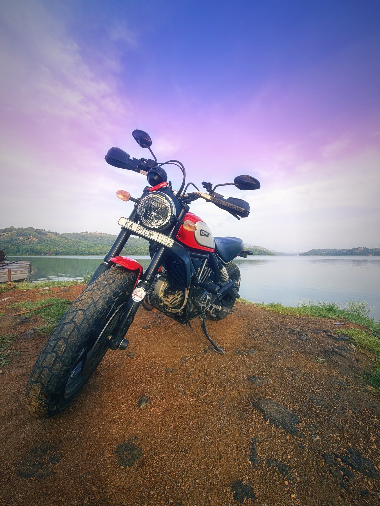

Nothing I've added to this bike came from a shop in India. Every part arrived in a box with a customs sticker on it, after a wait that felt personal.

That changes how you buy. When every part is a small import project, you stop impulse-buying shiny things and start asking one question: **what is this protecting, and what happens if I don't fit it?**

This is the full list, and the reasoning behind each part.

<!-- more -->

## The balcony workshop

I wanted to fit every one of these parts myself. Not because a workshop couldn't do it, but because I wanted to know exactly what was on the bike, how it was mounted, and how tight every bolt was.

That decision came with a problem: I don't have a garage. So the bike went up to my balcony, which became a workshop for as long as the build took. A Ducati on a balcony is not a sentence I expected to write, but here we are.

The second problem showed up the moment I opened the first box. I didn't have the tools. The basic kit that comes with the bike is fine for tightening a mirror and not much else. So before any part went on, there was a tool-shopping detour.

The biggest item on that list was torque wrenches, plural. **On a Ducati, everything has a torque spec.** Every bolt, from the little ones holding a guard to an axle nut, has a number in the manual, and those numbers cover a range that one wrench can't do accurately.

It's the closest thing a motorcycle has to a typed interface. Under-tighten and the part rattles loose on the first bad road. Over-tighten and you strip a thread in an aluminium casting, and now you're importing *another* part. **"Tight enough" is not a value. The spec is.**

It took longer than a workshop would have. I also know every bolt on this bike, and I know each one is right.

## Sliders are cheap. Ducati parts are not.

The Scrambler is a naked bike. There's no fairing to take a hit, so when it goes down, even at walking pace, the first things to touch the ground are the expensive ones: the engine cases, the fork legs, the swingarm, the frame.

Crash protection is a trade. You bolt on a cheap sacrificial part so the expensive part never meets the tarmac.

- **Evotech frame sliders.** The first line of defence in a tip-over or low-side. They take the scrape so the frame and engine don't.
- **Front fork sliders.** They sit on the front axle and keep the fork legs and brake caliper off the ground if the front tucks.
- **Evotech rear swingarm sliders.** Same idea at the back, protecting the swingarm and rear axle. They double as paddock stand bobbins.

**A slider is a unit test for gravity.** You hope it never fails, but you really want it there the day it runs.

## Armour for the underbelly

The other threat isn't falling over. It's what the front wheel throws at the bike. Indian roads are generous with gravel, stones and things that used to be part of other vehicles.

- **Evotech sump guard.** A bash plate under the engine. It's the part that makes me stop worrying on the last stretch of dirt to a lake.
- **Evotech "radiator" guard.** The Scrambler 800 is air-cooled, so technically this is an oil cooler guard. It sits right in the firing line behind the front wheel, and a stone through the cooler ends the ride.
- **Evotech rectifier guard.** The regulator-rectifier also lives behind the front wheel. It's a small, unglamorous box, and without it the battery stops charging. A honeycomb aluminium grille keeps stones out and lets air through.
- **Evotech headlight guard.** The honeycomb grille over the round headlight. It protects the glass from stones kicked up by the car in front. It also makes the front of the bike look properly purposeful.

None of these make the bike faster. All of them make it harder to strand me somewhere.

## Letting it breathe

- **K&N air filter.** Washable and reusable, and it flows better than the paper stock item. Given how much dust these roads throw at the intake, a filter I can clean and refit makes more sense than one I throw away.
- **K&N oil filter.** It has a nut welded onto the end, so it comes off with a spanner instead of a fight.

I'm not claiming horsepower gains here. It's about maintenance that's easier and repeatable, which is really the same philosophy as good infrastructure.

## Stopping is a feature

The stock brakes are fine. Fine isn't the target.

- **HEL Performance braided brake lines.** Stainless braided lines don't balloon under pressure the way rubber hoses do. The lever goes firmer and the bite is more consistent, especially when the brakes are hot.
- **Sintered brake pads.** More bite, better in the wet, and happier with heat. On a bike that sees rain, dust and the occasional panic stop behind a bus, that matters.
- **Evotech clutch and brake levers.** Better shaped and adjustable, so the lever sits where my fingers actually are, not where a factory average says they should be.

**The best brake upgrade is the one you never notice until you need it.** Then it's the only thing you notice.

## Seeing, and being seen

- **Denali DL4 and DL2 driving lights with a dimmer controller.** The Scrambler's stock headlight is charming and not much else. The Denali DL-series driving lights throw light far down the road on a dark highway, and with the dimmer I can run them at a lower intensity in town so I'm visible without blinding everyone coming the other way. For a 5 AM start, this is the single best thing on the bike.
- **Healtech ThunderBox TB-U02.** This is the part the engineer in me is proudest of. Instead of tapping into the bike's ignition wiring for every accessory, everything runs through one power distribution module wired to the battery. It senses when the engine is running and charging, switches the accessories on, and switches them all off when the engine stops. No spliced factory looms, and no lights left draining the battery overnight.

It's the right architecture: **one supervised power bus instead of a nest of point-to-point hacks.** If you've ever untangled someone else's accessory wiring, you know exactly why.

## The tail tidy tax

The **Evotech tail tidy** replaces the long stock number-plate hanger with something short and clean. It makes the back of the bike look finished, the way it always should have looked.

It also removes the thing that was stopping the rear tyre from painting a stripe of mud up my back.

The first wet ride after fitting it taught me that lesson in one go. So the fix got two more parts:

- **Puig tyre hugger.** Sits close over the rear tyre and catches most of what it throws.
- **Ducati rear mudguard.** Deals with the rest, because my back getting muddy was not the aesthetic I was going for.

Every change has side effects. **The tail tidy shipped a regression, and the hugger and mudguard were the patch.**

## Importing all of it

Buying every part from abroad teaches a few things quickly:

- **Buy by exact model and year.** Evotech lists parts by part number and fitment range. Check it twice, because a return means another round trip through customs.
- **Batch your orders.** Each shipment carries its own shipping cost and customs overhead. One larger order hurts less than five small ones.
- **Protection first, then the fun stuff.** The sliders and guards went on before anything cosmetic. A bike in pieces waiting for a Ducati part to arrive is a bike you're not riding.
- **Budget for tools, not just parts.** If you're doing it yourself, the torque wrenches, sockets and bits are part of the build cost. Buy them before the parts arrive, not after.
- **Keep the stock parts.** The original tail, filters and lines are worth holding on to, for future you or a future buyer.

## The full list

| Area | Part |
|---|---|
| Crash protection | Evotech frame sliders, front fork sliders, Evotech rear swingarm sliders |
| Underbody | Evotech sump guard, oil cooler ("radiator") guard, rectifier guard, headlight guard |
| Intake & service | K&N air filter, K&N oil filter |
| Brakes & controls | HEL Performance braided brake lines, sintered pads, Evotech clutch and brake levers |
| Lighting & power | Denali DL4 and DL2 with dimmer controller, Healtech ThunderBox TB-U02 |
| Rear end | Evotech tail tidy, Puig tyre hugger, Ducati rear mudguard |

Nothing on the list makes the Scrambler a different bike. It makes it the same bike, harder to hurt, easier to live with, and ready for a 5 AM start. Every part was imported, fitted on a balcony, and torqued to spec by hand. That was the whole spec.

<!-- RELATED_START -->
<aside class="pr-related" markdown="0">
  <h2 class="pr-related-head">Related reading</h2>
  <a class="pr-related-item" href="my-ducati-didnt-sign-up-for-e20.md">My Ducati didn't sign up for E20, and neither did IIndia went E20 at nearly every pump — premium grades included. The only ethanol-free petrol left is 100-octane, costs ₹168 a litre, and is out of stock across most of Bengaluru.</a>
  <a class="pr-related-item" href="the-100kmph-build-list.md">The 100km/h build list: every part, every reasonA full custom 1/8 scale RC buggy built entirely by hand — chassis kit, motor, ESC, batteries, and every bolt chosen individually. The complete parts list for a 100km/h build sourced from India.</a>
  <a class="pr-related-item" href="rc-cars-and-the-india-parts-problem.md">My first RC car build: an engineer's guide to pain in IndiaApproaching RC cars like a software person — choosing a platform, brushless ESCs, LiPo safety, and the uniquely Indian challenge of getting parts at all.</a>
</aside>
<!-- RELATED_END -->
