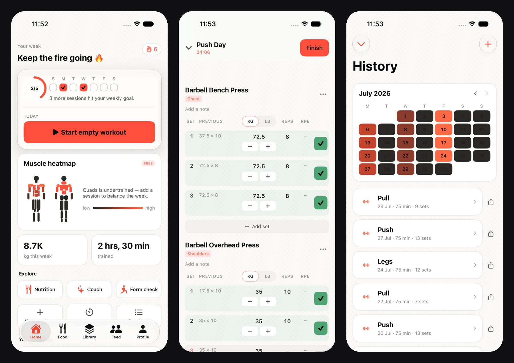
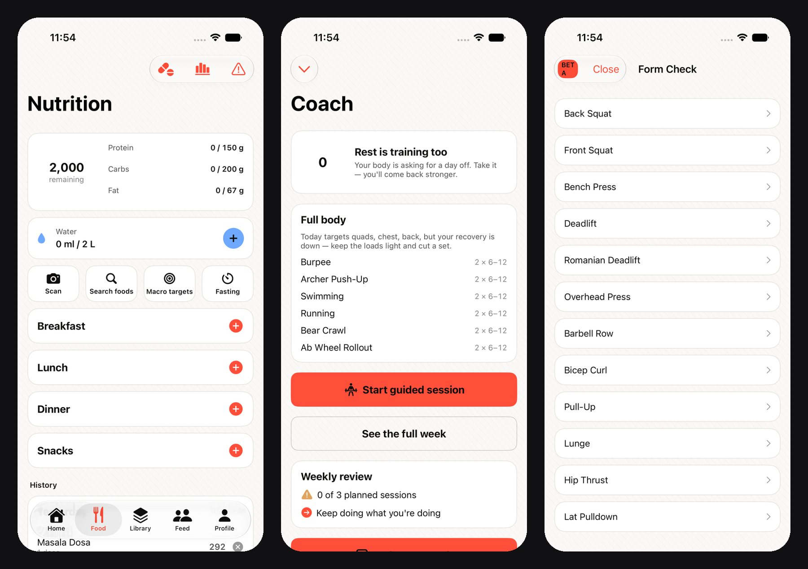
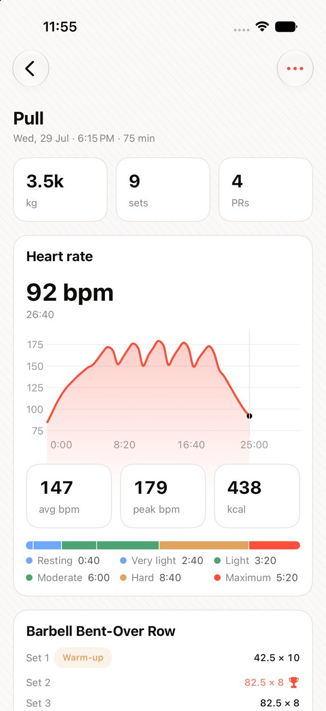

Every serious lifter I know has the same complaint about workout apps. They're either pretty and shallow, or deep and ugly. They get the maths subtly wrong, they stall when the gym Wi-Fi drops, and they bolt on AI features that feel like a demo.

**Krovu** is my answer. It's a professional-grade strength tracker for iPhone and Apple Watch, and I built it to be better than anything else on the App Store: faster to log with, stricter about the numbers, and genuinely intelligent where it matters.

It's live on the [App Store](https://apps.apple.com/app/id6790511917): strength logging, HIIT timers, a muscle heatmap, nutrition photo logging, an AI coach and on-device form analysis. This is how it's put together, and why it's built the way it is.

<!-- more -->



## What it is

At its core Krovu is an uncompromising strength logger. You log sets with the previous session pre-filled, so progressive overload is one glance away. Warm-ups, drop sets and failure sets are first-class set types, and warm-ups are kept out of your volume and personal records, because a warm-up is not an achievement.

Around that core sit three tiers:

- **Free:** workout logging, HIIT timers (intervals, EMOM, Tabata), personal records, the social feed and the **muscle heatmap**.
- **Pro:** nutrition logging from a photo, unlimited routines and full history.
- **Coach:** AI-adapted training, on-device **Form Check**, an AI trainer and diet plans.

One rule is written into the codebase in capital letters: **the muscle heatmap is free and must never be gated.** It's the feature that tells you what you're neglecting, and I'd rather people used it than paid for it.

## The numbers

Krovu went from an empty repository on 13 July 2026 to an approved App Store release in roughly two months. As of mid-September:

| What | How much |
|---|---|
| Commits | ~510 |
| Swift | ~200,000 lines across 30 modules |
| Tests | ~3,000 Swift Testing cases |
| Backend | ~28,000 lines of TypeScript |
| Architecture decision records | 25 |
| Exercises in the catalogue | 886 |

It was built on a Mac mini M4 Pro with 24 GB of RAM. That machine has one hard rule: **one simulator at a time**, and never Android tooling while Xcode is building. You learn to schedule a build the way you'd schedule a deploy.

## The stack

Nothing exotic, and that's deliberate:

- **Swift 6 with strict concurrency** and SwiftUI with `@Observable`. UIKit only when a control is impossible in SwiftUI.
- **GRDB** over SQLite for local storage. Not SwiftData, not Core Data. I wanted SQL I can read and migrations I control.
- **Tuist** generates the Xcode project. The `project.pbxproj` is never hand-edited. It's a build artifact, and treating it as source is how merge conflicts eat afternoons.
- **StoreKit 2** for subscriptions, with entitlements resolved **server-side** from App Store Server Notifications. The device doesn't get to decide what the user paid for.
- A **TypeScript backend on Cloud Run**, with Postgres on Cloud SQL, Firebase for auth, App Check and Remote Config, and all of it in Terraform.

The app is thirty modules. Core packages (models, database, sync, networking, design system, entitlements) sit underneath, and fifteen feature modules sit on top. **Feature modules never depend on each other.** When two features need the same thing, it moves down into a core package. It's the same discipline as not letting microservices call each other's databases, and it pays off the same way.

## Offline-first, for real

"Works offline" is on a lot of marketing pages. In Krovu it's a rule: **every screen must work with no network.** A professional tool can't pause because the signal did. Writes go into the local database instantly, queue up, and sync when there's signal.

The interesting part is what happens when two devices disagree. You log a set on the Watch mid-workout, then fix a typo on the phone on the train home. Both edits are legitimate, and both need to survive.

Row-level last-write-wins can't do that. If the phone edits the title and the Watch edits the notes, whichever row lands second carries a stale copy of the other field and silently destroys it. So Krovu's sync carries **a timestamp per field**:

```jsonc
{
  "id": "0193b1f0-...-000a",
  "fields":         { "title": "Chest Day", "notes": null },
  "fieldUpdatedAt": { "title": "2026-01-01T11:00:00.000Z",
                      "notes": "2026-01-01T10:00:00.000Z" }
}
```

Each field is its own last-write-wins register. The row's `updatedAt` is derived as the max, so it can never drift from the values that actually drive resolution. A few properties fall out of that almost for free:

- **Deletes are just another field.** `deletedAt` is an ordinary register, so a delete beats an older update in any arrival order, and "undo delete" propagates like any other edit.
- **Rows are never hard-deleted.** A phone that's been offline for a month still needs to learn the row went away.
- **Push is idempotent by construction.** The merge is a join on a semilattice, so re-sending something the server already has is a no-op mathematically, not by bookkeeping.

Every row carries a UUIDv7 id, `updatedAt`, `deletedAt` and a `syncState`. All writes go through a repository layer, never straight from a view. **Migrations are append-only.** Once a migration has shipped, it is never edited again.

## The math stays on the phone

With Android on the roadmap, there was an obvious proposal: move all the training math to the server and have every client call it. One implementation, one place to fix bugs.

I wrote an ADR rejecting it. **The math a human waits for stays on the device.** Volume updates per set. The estimated one-rep max updates per set. PR detection fires the celebration the moment you save. Putting a network round trip in front of any of that taxes exactly the interactions that have to feel instant, which is what separates a professional tool from a toy.

Instead, the rules live in one shared fixture: 141 test vectors across five rule families, covering volume, the Epley one-rep max (and only for sets of 12 reps or fewer), the four PR types, ISO-week streaks with a monthly freeze, and per-muscle load with secondary muscles counted at half. Every implementation executes the same file, so **the spec is a test, not a document.**

The argument *for* the server was real, though, and the ADR says so: on the server, a rule bug is a deploy, not an App Store release. I learned that the hard way.

## The bug that doubled people's lifts

When you lift with two dumbbells, the volume should count both. Krovu decided which exercises were "paired" from the exercise **name**. Anything with "Dumbbell" in it got doubled.

Thirteen were wrong. `Dumbbell Pullover` is one dumbbell held in both hands, and so are `Dumbbell Triceps Extension` and `Dumbbell Triceps Kickback`. Each exercise's own instructions say so. Four of them had been inflating real users' volume, per-muscle load and PRs by 2× in production.

The fix re-checked every flag against the exercise's written instructions instead of its name, and added a test that fails on any new disagreement between the two. Because volume is recomputed live, **history re-scored itself downwards**. Nothing stored was edited; the numbers simply became honest. Telling users their lifts just went down is not a fun changelog entry to write. It's still better than lying to them.

**A number people train by is a contract. Get it wrong and you've shipped a breaking change to their confidence.**

## Form Check, on the device

The Coach tier's headline feature is **Form Check**: point the camera at yourself and Krovu watches the lift. It runs pose estimation with Apple's Vision framework **on the device**, counting reps and checking depth, tempo, range of motion and asymmetry, with safety flags for things like hips rising too fast on a deadlift.



Two privacy rules are enforced in code, not just promised on a consent screen. **Video never leaves the phone** unless you explicitly opt into cloud processing. And there's deliberately no microphone permission at all: Form Check records video only, and asking for a permission you don't use invites questions you can't answer.

Form Check also taught me the most useful testing lesson of the project. Five tests for one of the safety checks all passed while that check was completely dead on the lift it was named for. Every test built its input by hand instead of pushing real frames through the real pipeline. **A fixture that holds a check's inputs constant proves nothing about that check.** It only proves the check was handed a constant.

## Where the AI actually runs

The AI features are split by where the data should live:

- **Pose estimation** for Form Check runs on the device, with Apple Vision.
- **Food photos** for nutrition logging and the **AI coach's** replies go to a Gemini model on Vertex AI, through the backend. The app never talks to the model directly.
- **Apple Intelligence** (the on-device Foundation Models) is confined to a single module, the only place in the codebase allowed to import it. When that API changes, and it will, it changes in one place.

And one rule outranks all of them: **HealthKit data never goes into a log or into analytics.** Heart rate, sleep and weight come in through one service and stay there.



That heart-rate panel is a good example of the approach. A workout logged on the phone originally had no heart rate, even if you wore an Apple Watch. Now, when a finished workout has none, Krovu reads what Apple Health already recorded for that time window and builds the panel from it. No new upload, no new prompt, nothing sent to analytics.

## Getting past App Review

Version 1.0 was **rejected**.

The annual subscription card showed its price as a calculated per-month figure, with the real yearly charge in small caption text underneath. Apple's guideline 3.1.2(c) is clear that the headline price must be what's actually billed. It was a fair call. The fix puts the billed amount first and the monthly equivalent second, and there's now a note in the repository saying never to regress it.

The rest of the App Store checklist is less dramatic, but just as easy to get wrong:

- **Sign in with Apple is mandatory** as soon as you offer Google sign-in.
- **A social feed means user-generated content:** you need filtering, reporting and blocking, and Apple expects reports acted on quickly.
- **In-app account deletion** is required, not optional.
- **The privacy manifest** gets checked automatically minutes after upload, before a human ever sees the build.
- **Push notifications** have a quiet trap: a release build stamped with the development APNs environment gets tokens production rejects, and push silently never arrives.

## Things that broke in interesting ways

A few bugs I'm still quietly proud of finding:

- **Links that never opened.** For weeks, tapping a `krovu://` link in Messages or Safari did nothing, because the app had never registered its own URL scheme. Nobody noticed, because widget and Live Activity taps worked fine: iOS hands a widget's URL straight to its own app without checking the scheme registry. **The happy path hid the broken one.**
- **Tests that passed locally and failed in CI.** Xcode Cloud runs tests on machines that never check out the repository. Any test reading a fixture file by path passed on my Mac and took its whole module down on CI. Fixtures now ship inside the test bundle.
- **Clips of the wrong lift.** Matching 886 exercises to a library of demonstration clips by name similarity gave `Band Glute Kickback` a clip of a triceps kickback. The matcher now uses containment plus four gates that reject a clip outright, and 321 exercises have no clip at all rather than a wrong one. **A clip of the wrong lift is worse than no clip.**
- **One environment, and it's production.** The GCP project is called `krovu-dev`. That name is historical. There is no other environment, so every deploy and every migration is live for real users, and treated that way.

## Built with agents, run by rules

Most of Krovu's code was written with AI coding agents, and the reason it holds together is that the repository tells them exactly how to behave. A `CLAUDE.md` at the root pins the stack, the domain rules, the commands, a definition of done, and a "never do" list: never hand-edit the project file, never add a tracking SDK, never put health data in a log, never rewrite a shipped migration.

Every task has to build with zero warnings, pass the tests and a strict lint gate, and, for anything visual, come with simulator screenshots in both light and dark mode that have actually been looked at. Every architectural decision gets an ADR, and there are twenty-five of them now.

The agents are fast. The rules are what make them safe to be fast. **An agent without guardrails is just a very confident intern with commit access.**

## What's next

Krovu has already been trimmed once: a web app existed, and I retired it. It was a second product to maintain for users who were never going to log a set from a laptop. The website at [krovu.app](https://krovu.app) is now marketing only.

Next is **Android**, native Kotlin and Jetpack Compose, not a cross-platform layer. The shared rule fixture already runs there, which means the second implementation has to agree with the first on every one of those 141 vectors before it ships.

If you take your training seriously, try it. The heatmap's free, and the rest is the best I know how to build.

<!-- RELATED_START -->
<aside class="pr-related" markdown="0">
  <h2 class="pr-related-head">Related reading</h2>
  <a class="pr-related-item" href="scheduling-without-losing-your-mind.md"><span class="pr-related-title">Scheduling without losing your mind</span><span class="pr-related-desc">Heartbeats, sharded schedulers, at-least-once delivery, and load shedding — the parts of distributed scheduling that nobody draws on the whiteboard.</span></a>
  <a class="pr-related-item" href="why-postgres-stays-sacred.md"><span class="pr-related-title">Why Postgres stays sacred</span><span class="pr-related-desc">Caches lie with TTLs, replicas lie with lag. Postgres is where the lies stop — why the source of truth stays in a database that means what it says.</span></a>
  <a class="pr-related-item" href="chat-is-the-easy-part.md"><span class="pr-related-title">Chat is the easy part</span><span class="pr-related-desc">What it actually took to bolt WebSocket streaming onto Astra — and why the session model matters more than the protocol.</span></a>
</aside>
<!-- RELATED_END -->
