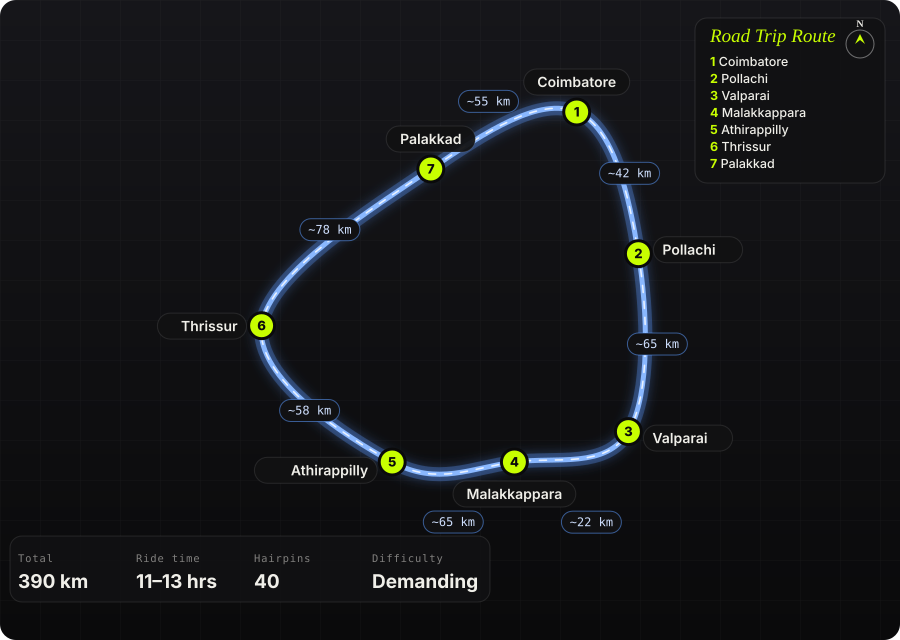
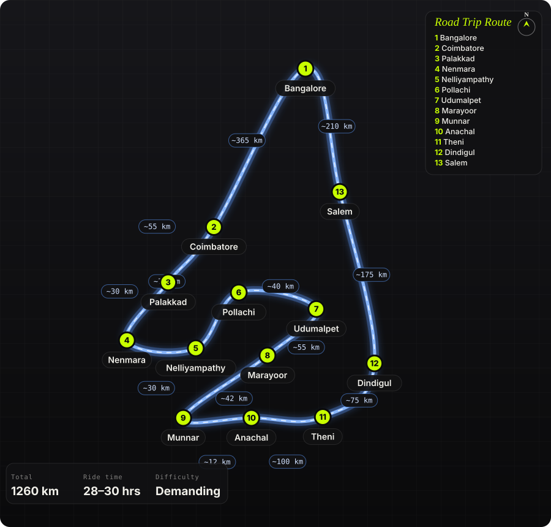

  

    

      
Building infrastructure for agents

      <h1 class="pr-hero-title">Systems that <em>survive</em> production</h1>
      

        I'm Prashanth. Fifteen years building software — mostly the kind that has to work when you're asleep. Currently designing <strong>Astra</strong>, an operating system for autonomous agents: microkernel, actor runtime, planet-scale task graph, 100M+ tasks/day.
      

      

        <a class="pr-btn-primary" href="wiki/astra/">Explore Astra →</a>
        <a class="pr-btn-ghost" href="blog/">Blog →</a>
      

    

      <!-- LATEST_BLOG_AUTOGEN_START -->
      <a class="pr-featured-post" href="blog/posts/my-ducati-didnt-sign-up-for-e20/">Latest postMotorcycles15 Sep 2026My Ducati didn&#x27;t sign up for E20, and neither did IIndia went E20 at nearly every pump — premium grades included. The only ethanol-free petrol left is 100-octane, costs ₹168 a litre, and is out of stock across most of Bengaluru.Read the post &rarr;</a>
      
<h2 class="pr-recent-title">More writing</h2><a class="pr-section-link" href="blog/">All posts &rarr;</a>

      

        <a class="pr-post-card" href="blog/posts/the-100kmph-build-list/">DIY2 Apr 2026The 100km/h build list: every part, every reasonA full custom 1/8 scale RC buggy built entirely by hand — chassis kit, motor, ESC, batteries, and every bolt chosen individually. The complete parts list for a 100km/h build sourced from India.</a>
        <a class="pr-post-card" href="blog/posts/litellm-and-the-trust-chain-nobody-audits/">Security26 Mar 2026LiteLLM and the trust chain nobody auditsA compromised security scanner led to malicious LiteLLM PyPI packages that harvested credentials and spread through Kubernetes clusters in three hours.</a>
        <a class="pr-post-card" href="blog/posts/sandboxes-arent-security-theater/">Astra24 Mar 2026Sandboxes aren&#x27;t security theaterWASM, Docker, Firecracker — the spectrum of sandboxing when agents run tools you didn&#x27;t write. Deny by default, allow by exception.</a>
        <a class="pr-post-card" href="blog/posts/scheduling-without-losing-your-mind/">Astra24 Mar 2026Scheduling without losing your mindHeartbeats, sharded schedulers, at-least-once delivery, and load shedding — the parts of distributed scheduling that nobody draws on the whiteboard.</a>
      

  <!-- LATEST_BLOG_AUTOGEN_END -->
  <!-- ROADTRIPS_HOME_START -->
      
<h2 class="pr-recent-title">Road trips</h2><a class="pr-section-link" href="roadtrips/">All trips &rarr;</a>

      

        <a class="pr-trip-card" href="roadtrips/valparai-athirappilly-loop/">South IndiaValparai – Athirappilly Forest LoopCoimbatore → Pollachi → Valparai (40 hairpins) → Malakkappara forest road → Athirappilly Falls → Thrissur → Palakkad → Coimbatore. ~400 km in a day, billed as South India&#x27;s most dangerous road.<b>390</b> km<b>11–13 hrs</b><b>40</b> hairpins<b>Demanding</b></a>
        <a class="pr-trip-card" href="roadtrips/nilgiri-loop/">South IndiaThe Nilgiri LoopBangalore → Dimbam ghat → Kotagiri → Coonoor → Ooty → Gudalur → Mudumalai → Bandipur → Bangalore. 610 km, two tiger reserves and a 27-hairpin climb.<b>610</b> km<b>14–16 hrs</b><b>27</b> hairpins<b>Moderate</b></a>
        <a class="pr-trip-card" href="roadtrips/nelliyampathy-munnar-loop/">South IndiaNelliyampathy &amp; Munnar Back-Door LoopBangalore → Coimbatore → Palakkad → Nenmara → Pothundi dam → Nelliyampathy → Pollachi → Udumalpet → Chinnar → Marayoor → Munnar → Anachal glass bridge → Bodimettu ghat → Theni → Dindigul → Salem → Bangalore. ~1,260 km over four days, entering and leaving Munnar by its two quiet roads.<b>1260</b> km<b>28–30 hrs</b><b>Demanding</b></a>
      

  <!-- ROADTRIPS_HOME_END -->
  

