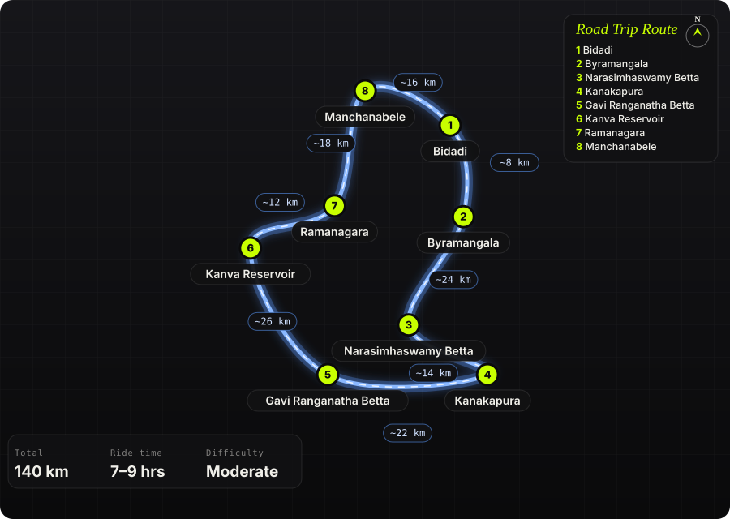

South India · India · 1 day (incl. ~2 hrs of trekking)

<h1 class="rt-title">Bidadi Twin-Betta Loop</h1>

Bidadi → Byramangala backwaters → Narasimhaswamy Betta (fort-hill trek) → Kanakapura → Gavi Ranganatha Betta (cave temple, mud track to the top) → Kanva reservoir → Ramanagara → Manchanabele backwaters → Bidadi. ~140 km of village roads, two hill temples, two dirt sections.

hill templestrekfortcave templebackwatersdirt trackday loopmotorcycle

Distance<b>140 km</b>

Ride time<b>7–9 hrs</b>

Difficulty<b>Moderate</b>

Best season<b>Sep – Feb</b>

Start<b>Bidadi</b>

A one-day loop out of Bidadi that strings together two little-visited hill temples south of Bangalore — Shri Narasimhaswamy Betta, a fort hill above Vadedoddi with stone steps and ruined ramparts, and Gavi Ranganatha (Gaviranga) Betta near Singarajapura, where the shrine sits in a cave behind a pond and a mud track climbs the hill. Between them the route deliberately stays off the Mysore highway: reservoir bund roads at Byramangala and Kanva, the granite-boulder country around Ramanagara, and a finish through the Manchanabele backwaters where the tarmac gives out into dirt. Short enough to start at 6 AM and be home for dinner, with about two hours of walking.

Route idea: Instagram location tag — Narasimha Swamy Hill Temple, Bidadi &amp; Gavi — the two pins that started this; the loop around them is my own

## The route

Schematic map generated from waypoint coordinates — the shape follows the geography (compressed so long legs don't squash the loop), distances are labelled per leg. Not a navigation map. <a href="bidadi-twin-betta-loop-route.svg" download>Download the graphic</a>.

<h3>Leg by leg</h3>

<table class="rt-segs"><thead><tr><th>#</th><th>Leg</th><th>Dist</th><th>Notes</th></tr></thead><tbody><tr><td>1</td><td><b>Bidadi → Byramangala</b>
Bidadi – Byramangala road
</td><td class="rt-km">8 km</td><td>Leave the highway immediately. Narrow road along the Byramangala reservoir bund — pelicans and painted storks in winter, best at first light. tarmac</td></tr><tr><td>2</td><td><b>Byramangala → Narasimhaswamy Betta</b>
Byramangala → Kanchugaranahalli → village roads to Vadedoddi
</td><td class="rt-km">24 km</td><td>Single-lane village roads through ragi fields and eucalyptus. Navigate by map to &#x27;Shri Narasimhaswamy Betta&#x27;; the last km is a concrete road behind an arch, often locked — park outside and walk. narrow tarmac / concrete</td></tr><tr><td>3</td><td><b>Narasimhaswamy Betta → Kanakapura</b>
Vadedoddi – Kanakapura
</td><td class="rt-km">14 km</td><td>Back to a proper road. Kanakapura is the fuel and lunch stop — the only real town on the loop. tarmac</td></tr><tr><td>4</td><td><b>Kanakapura → Gavi Ranganatha Betta</b>
Kanakapura – Channapatna road, turn for Haniyuru / Singarajapura
</td><td class="rt-km">22 km</td><td>Rolling farmland with granite outcrops. Mud road up the hill to the temple; a stone-step trail if you&#x27;d rather walk it. tarmac, then mud track</td></tr><tr><td>5</td><td><b>Gavi Ranganatha Betta → Kanva Reservoir</b>
Haniyuru → Channapatna → Kanva dam road
</td><td class="rt-km">26 km</td><td>Channapatna (toy town) is the only busy bit. Turn off for Kanva — quiet bund road along the reservoir with hills all round. tarmac</td></tr><tr><td>6</td><td><b>Kanva Reservoir → Ramanagara</b>
Kanva – Ramanagara
</td><td class="rt-km">12 km</td><td>Into the boulder country that Sholay was shot in. Ramadevara Betta is a short detour if daylight allows (closes 5:30 PM). tarmac</td></tr><tr><td>7</td><td><b>Ramanagara → Manchanabele</b>
Ramanagara – Manchanabele road
</td><td class="rt-km">18 km</td><td>Broken village road, then the dam. Dirt tracks around the backwaters — the loop&#x27;s proper off-road section. broken tarmac / dirt</td></tr><tr><td>8</td><td><b>Manchanabele → Bidadi</b>
Manchanabele – Bidadi
</td><td class="rt-km">16 km</td><td>Quiet run back to Bidadi through farmland, past the Big Banyan Tree turn-off. tarmac</td></tr></tbody></table>

<h3>Highlights</h3><ul><li>Shri Narasimhaswamy Betta — an hour&#x27;s climb up ancient stone steps past overgrown fort walls to a small temple and pool on top; almost nobody but villagers goes.</li><li>Gavi Ranganatha Betta — Rishyashringa&#x27;s cave shrine behind a pond, Bhairaveshwara temple alongside, and a 360° view over Mari Betta, SRS hills and the lake below.</li><li>Byramangala and Kanva reservoirs — two bund roads that most riders skip, both empty at dawn.</li><li>Ramanagara&#x27;s granite boulders on the Kanva road — Sholay country without the Sholay traffic.</li><li>Manchanabele backwaters at sunset — dirt tracks down to the water with Savandurga on the skyline.</li></ul>

<h3>Off-road &amp; motorcycling notes</h3>
<i class="on"></i><i class="on"></i><i class="on"></i><i class=""></i><i class=""></i>

Mostly single-lane village tarmac with two genuine dirt sections: the mud track up Gavi Ranganatha Betta and the backwater trails at Manchanabele. Both are fine on an ADV or scrambler in the dry; on a road bike walk the hill and stop at the dam.
<ul><li>Gavi Ranganatha mud road: loose red soil and rock steps; rideable in dry months, slick as soap after rain. Low tyre pressures help.</li><li>Manchanabele backwater tracks: soft sand near the water&#x27;s edge, ruts from 4x4s. Turn around before the ground goes dark and wet — bikes sink.</li><li>Narasimhaswamy Betta: no riding above the arch. The trek is 30–60 min up with loose soil on the descent — proper shoes, not riding boots.</li><li>Village roads near Vadedoddi: unmarked speed breakers, cattle, and sudden gravel patches where the surface has been dug up.</li><li>Carry a tyre-plug kit; there is nothing between Kanakapura and Ramanagara.</li></ul>

<h3>Timings, permits &amp; fuel</h3><ul><li>Gavi Ranganatha cave shrine is opened only on Saturdays and festival days — ride it on a Saturday if you want to go inside; the hill and outer temple are open daily (roughly till 6 PM).</li><li>Narasimhaswamy Betta temple opens around 8 AM; the gate road may be locked — park outside and walk.</li><li>Ramadevara Betta closes at 5:30 PM. Manchanabele dam area is best left before dark; no lighting.</li><li>Fuel: Bidadi at the start, Kanakapura mid-loop, Ramanagara near the end. Locals near Narasimhaswamy Betta sell bottled petrol in a pinch.</li><li>No permits. Both hill temples are free; small parking fee at Gavi Ranganatha.</li></ul>

<h3>Cautions</h3><ul><li>Gavi Ranganatha&#x27;s hill is surrounded by forest — bears visit the artificial pond. Don&#x27;t linger after dusk, don&#x27;t leave food out.</li><li>The Narasimhaswamy Betta pool is polluted by offerings; carry your own water for the trek.</li><li>Monsoon (Jun–Aug) makes both dirt sections unrideable and the stone steps slippery; the reservoirs are prettiest right after, in Sep–Oct.</li><li>Google Maps will try to put you back on the Mysore highway between Channapatna and Bidadi — ignore it and follow the Kanva/Ramanagara/Manchanabele legs.</li></ul>

## Along the way

<figure><figcaption>Granite boulder country around Ramanagara <a href="https://commons.wikimedia.org/wiki/File:Ramanagara_Hills_%2810306067976%29.jpg" rel="noopener">Wikimedia Commons · free licence, see file page</a></figcaption></figure><figure><figcaption>Byramangala reservoir near Bidadi <a href="https://commons.wikimedia.org/wiki/File:Byramangala.jpg" rel="noopener">Wikimedia Commons · free licence, see file page</a></figcaption></figure><figure><figcaption>Kanva reservoir, Channapatna <a href="https://commons.wikimedia.org/wiki/File:Kanva_dam.jpg" rel="noopener">Wikimedia Commons · free licence, see file page</a></figcaption></figure><figure><figcaption>SRS hills — visible from the top of Gavi Ranganatha Betta <a href="https://commons.wikimedia.org/wiki/File:SRS_hills%2C_Ramanagara.jpg" rel="noopener">Wikimedia Commons · free licence, see file page</a></figcaption></figure><figure><figcaption>Ramadevara Betta, the optional detour near Ramanagara <a href="https://commons.wikimedia.org/wiki/File:Ramadevara_Betta_Hill_%281%29%2C_Karnataka.png" rel="noopener">Wikimedia Commons · free licence, see file page</a></figcaption></figure><figure><figcaption>Farmland south of Kanakapura <a href="https://commons.wikimedia.org/wiki/File:Sathanur%2C_Kanakapura%2C_Karnataka.jpg" rel="noopener">Wikimedia Commons · free licence, see file page</a></figcaption></figure><figure><figcaption>Savandurga monolith on the skyline from the Manchanabele backwaters <a href="https://commons.wikimedia.org/wiki/File:Savandurga_Hill_01.jpg" rel="noopener">Wikimedia Commons · free licence, see file page</a></figcaption></figure>

## Sources &amp; further reading

<ul class="rt-sources"><li><a href="https://aravindgundumane.com/2025/02/sri-narasimhaswamy-betta-trek/" rel="noopener">Sri Narasimhaswamy Betta trek — Aravind Gundumane</a></li><li><a href="https://www.theloapers.com/2026/03/shri-narasimhaswamy-betta-trek-scouting.html" rel="noopener">Shri Narasimhaswamy Betta scouting trek — The Loapers (Feb 2026)</a></li><li><a href="https://medium.com/@punith/gavi-ranganatha-swamy-temple-gavi-rangana-betta-627a08c820c" rel="noopener">Gavi Ranganatha Swamy Temple (Gavi Rangana Betta) — Punith B M</a></li><li><a href="https://www.tripoto.com/karnataka/trips/it-is-not-down-on-any-map-true-places-never-are-ramanagara-channapatna-5f94795f868cd" rel="noopener">Gavi Ranganatha Swamy Temple — Tripoto</a></li><li><a href="https://ramanagara.nic.in/en/places-of-interest/" rel="noopener">Places of interest — Ramanagara district administration</a></li></ul>

<a href="../">← All road trips</a>

