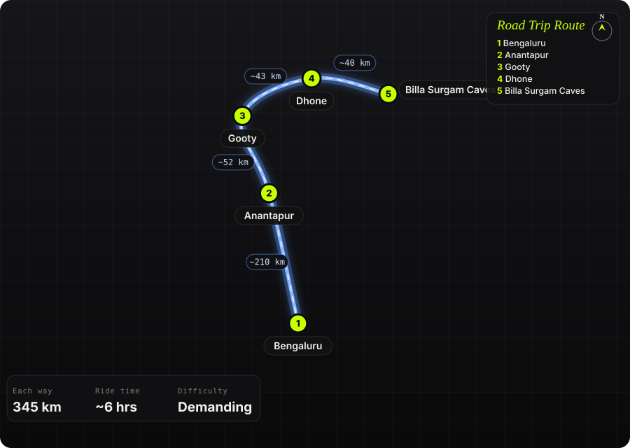

South India · India · 2 days

<h1 class="rt-title">Billa Surgam Caves</h1>

Bengaluru → Anantapur → Gooty → Dhone → Billa Surgam Caves. ~345 km, a limestone gorge and caves with an Ice Age past.

cavesgorgeandhra pradeshlong ridehistory

Each way<b>345 km</b>

Ride time<b>~6 hrs</b>

Difficulty<b>Demanding</b>

Best season<b>Nov – Feb</b>

Start<b>Bengaluru</b>

Billa Surgam is a partly unroofed limestone cave system in the Erramala hills near Betamcherla, in Andhra Pradesh&#x27;s Nandyal district (formerly Kurnool). The roof collapsed in places and left a meandering gorge about 250 m long with three natural rock bridges across it. This is most likely the canyon-like scene in the reel. Robert Bruce Foote excavated the caves in 1884 and found Pleistocene animal bones and Upper Palaeolithic tools. Getting there is a long NH 44 run across the Deccan plateau, with rough kutcha roads at the end.

Route idea: @nomad_sarva on Instagram

## The route

Schematic map generated from waypoint coordinates — the shape follows the geography (compressed so long legs don't squash the loop), distances are labelled per leg. Not a navigation map. <a href="billa-surgam-caves-route.svg" download>Download the graphic</a>.

<h3>Leg by leg</h3>

<table class="rt-segs"><thead><tr><th>#</th><th>Leg</th><th>Dist</th><th>Notes</th></tr></thead><tbody><tr><td>1</td><td><b>Bengaluru → Anantapur</b>
NH 44
</td><td class="rt-km">210 km</td><td>Long, straight four-lane highway north past Chikkaballapur and Penukonda onto the dry Anantapur plateau. tarmac</td></tr><tr><td>2</td><td><b>Anantapur → Gooty</b>
NH 44
</td><td class="rt-km">52 km</td><td>More fast highway, with Gooty&#x27;s hill fort showing on the right as you near town. tarmac</td></tr><tr><td>3</td><td><b>Gooty → Dhone</b>
NH 44
</td><td class="rt-km">43 km</td><td>Highway to Dhone, the last good fuel and food stop before the caves. tarmac</td></tr><tr><td>4</td><td><b>Dhone → Billa Surgam Caves</b>
Dhone–Betamcherla road + village track
</td><td class="rt-km">40 km</td><td>About 36 km east to Betamcherla, then a few km of kutcha road towards K.K. Kottala and the caves. mixed</td></tr></tbody></table>

<h3>Highlights</h3><ul><li>A meandering, partly unroofed limestone gorge spanned by natural rock bridges</li><li>Named chambers such as the Cathedral, Chapter House and Purgatory, explored since Foote&#x27;s 1884 excavations</li><li>One of South India&#x27;s most important Upper Palaeolithic sites</li><li>Easy to combine with Belum Caves or Yaganti, also in Nandyal district, on the second day</li></ul>

<h3>Off-road &amp; motorcycling notes</h3>
<i class="on"></i><i class="on"></i><i class=""></i><i class=""></i><i class=""></i>

Highway nearly all the way. The approach roads from Betamcherla and Palkuru are reported as kutcha tracks.
<ul><li>The last few km are unpaved and can rut badly after rain.</li><li>On a road bike, ride the final stretch slowly or park at the village and walk.</li><li>Upgrades to the access road have been proposed, so conditions may have changed.</li></ul>

<h3>Timings, permits &amp; fuel</h3><ul><li>About 6 hrs each way from Bengaluru with fuel and food stops</li><li>Stay overnight in Dhone, Betamcherla or Kurnool and ride back on day 2</li><li>Reported opening hours are 10:30 am – 6 pm with a ~₹50 ticket. Check locally before relying on this.</li></ul>

<h3>Cautions</h3><ul><li>Plateau heat is fierce from March to May. Start at dawn and carry plenty of water.</li><li>The site is remote with few facilities. Fuel up in Dhone.</li><li>The caves are dark and uneven inside, so bring a torch and sturdy shoes</li><li>This is a protected archaeological site: don&#x27;t remove or disturb anything</li></ul>

## Sources &amp; further reading

<ul class="rt-sources"><li><a href="https://grottomap.org/en/entrance/7oLVyOoI/billa_surgam" rel="noopener">Billa Surgam – Grotto Map</a></li><li><a href="https://www.siasat.com/just-280-km-from-hyderabad-lie-billasurgam-caves-older-than-time-3204723/" rel="noopener">Just 280 km from Hyderabad lie Billasurgam Caves older than time – Siasat</a></li><li><a href="https://www.outlooktraveller.com/destinations/india/billasurgam-caves-near-kurnool-and-hyderabad-in-andhra-pradesh" rel="noopener">All About Millenia-Old Billasurgam Caves – Outlook Traveller</a></li><li><a href="https://www.hyderabadfirst.in/?p=20990" rel="noopener">Billasurgam caves expected to get facelift – Hyderabad First</a></li><li><a href="https://en.wikipedia.org/wiki/Dhone" rel="noopener">Dhone – Wikipedia</a></li><li><a href="https://www.easemytrip.com/cabs/bangalore-to-bethamcherla-cab-booking/" rel="noopener">Bangalore to Bethamcherla – EaseMyTrip</a></li><li><a href="https://theunstumbled.com/billa-surgam-caves/" rel="noopener">Billa Surgam Caves guide – Unstumbled</a></li></ul>

<a href="../">← All road trips</a>

