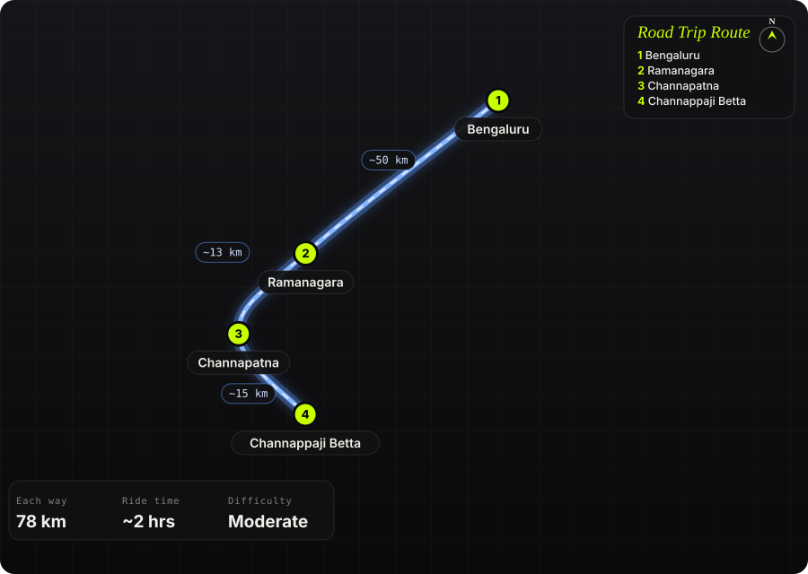

South India · India · Half day

<h1 class="rt-title">Channappaji Betta</h1>

Bengaluru → Ramanagara → Channapatna → Kodamballi → Channappaji Betta. ~78 km, a red-earth off-road climb to a hilltop temple.

offroadred earthhilltop templechannapatnaweekend

Each way<b>78 km</b>

Ride time<b>~2 hrs</b>

Difficulty<b>Moderate</b>

Best season<b>Oct – Feb</b>

Start<b>Bengaluru</b>

A short weekend off-road ride to Channappaji Betta, a small hill just east of Kodamballi village in Channapatna taluk, close to where Bengaluru South (Ramanagara) district meets Mandya district. The highway run to Channapatna is quick. From there the Channapatna–Halaguru road (SH-94) runs through farmland to Kodamballi, and an off-road trail of loose red earth climbs from the base village to a small temple at the top. Walkers can also hike up from neighbouring Ballapatna village.

Route idea: @trailson39t on Instagram

## The route

Schematic map generated from waypoint coordinates — the shape follows the geography (compressed so long legs don't squash the loop), distances are labelled per leg. Not a navigation map. <a href="channappaji-betta-route.svg" download>Download the graphic</a>.

<h3>Leg by leg</h3>

<table class="rt-segs"><thead><tr><th>#</th><th>Leg</th><th>Dist</th><th>Notes</th></tr></thead><tbody><tr><td>1</td><td><b>Bengaluru → Ramanagara</b>
NH 275 (Bengaluru–Mysuru)
</td><td class="rt-km">50 km</td><td>Fast four-lane highway out of the city. Use the expressway or the old road through Bidadi. tarmac</td></tr><tr><td>2</td><td><b>Ramanagara → Channapatna</b>
NH 275 (Bengaluru–Mysuru)
</td><td class="rt-km">13 km</td><td>Short hop past Ramanagara&#x27;s granite hills to Channapatna. tarmac</td></tr><tr><td>3</td><td><b>Channapatna → Channappaji Betta</b>
SH-94 (Channapatna–Halaguru) + village trail
</td><td class="rt-km">15 km</td><td>About 13 km of rural state highway to Kodamballi, then the off-road climb to the temple on loose red earth. mixed</td></tr></tbody></table>

<h3>Highlights</h3><ul><li>Off-road climb on red earth to a small hilltop temple</li><li>Wide views over Channapatna&#x27;s farmland from the top</li><li>Kodamballi lake and the old Ganga-era Maraleshwara temple in the village below</li><li>Short enough for a morning ride with breakfast on the way back</li></ul>

<h3>Off-road &amp; motorcycling notes</h3>
<i class="on"></i><i class="on"></i><i class="on"></i><i class=""></i><i class=""></i>

A moderate-to-difficult trail of loose red earth and rock from the base village to the summit temple. It suits an ADV like the KTM 390 Adventure.
<ul><li>The final climb is unpaved and loose in places, so stand on the pegs and keep momentum.</li><li>Red earth turns slick after rain. Avoid it when wet unless you run knobby tyres.</li><li>Ride up with a buddy, because help is far off on the trail.</li></ul>

<h3>Timings, permits &amp; fuel</h3><ul><li>Leave Bengaluru by 6 am to ride the trail before the heat builds</li><li>About 2 hrs each way including the trail section</li><li>Allow 30–60 min on the hill</li></ul>

<h3>Cautions</h3><ul><li>Small village temple and farmland: ride slowly through settlements and keep noise down</li><li>Expect no fuel or food on the hill. Fill up in Channapatna.</li><li>Hikers and campers use the hill too, so watch for people on blind sections</li><li>Carry your trash back down</li></ul>

## Sources &amp; further reading

<ul class="rt-sources"><li><a href="https://en.wikipedia.org/wiki/Kodamballi" rel="noopener">Kodamballi – Wikipedia</a></li><li><a href="https://villageinfo.in/karnataka/bengaluru-south/channapatna/kodamballi/" rel="noopener">Kodamballi – villageinfo.in</a></li><li><a href="https://in.worldorgs.com/catalog/kodambahalli/park/channappaji-betta" rel="noopener">Channappaji Betta, Kodambahalli – worldorgs listing</a></li></ul>

<a href="../">← All road trips</a>

