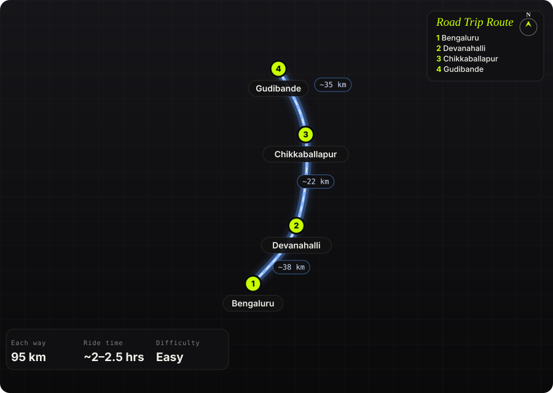

South India · India · Half day

<h1 class="rt-title">Gudibande Fort</h1>

Bengaluru → Devanahalli → Chikkaballapur → Gudibande. ~95 km, a 17th-century hill fort with 19 rock-cut rainwater tanks.

forthistoryhilllakenh44

Each way<b>95 km</b>

Ride time<b>~2–2.5 hrs</b>

Difficulty<b>Easy</b>

Best season<b>Oct – Feb</b>

Start<b>Bengaluru</b>

Gudibande Fort crowns a conical granite hill above a small town and lake in Chikkaballapur district. It was built in the 17th century by the local chieftain Byre Gowda, remembered as a Robin Hood who robbed the rich to help the poor. Around 400 broad stone steps climb through gateways and seven levels of walls past a chain of linked rock ponds to the Rameshwara temple on top. The ride is almost all on smooth NH 44, with a short run on district roads at the end.

Route idea: @twoofusonwheels on Instagram

## The route

Schematic map generated from waypoint coordinates — the shape follows the geography (compressed so long legs don't squash the loop), distances are labelled per leg. Not a navigation map. <a href="gudibande-fort-route.svg" download>Download the graphic</a>.

<h3>Leg by leg</h3>

<table class="rt-segs"><thead><tr><th>#</th><th>Leg</th><th>Dist</th><th>Notes</th></tr></thead><tbody><tr><td>1</td><td><b>Bengaluru → Devanahalli</b>
NH 44 (Bellary Road / airport road)
</td><td class="rt-km">38 km</td><td>City exit and the fast airport highway to Devanahalli. tarmac</td></tr><tr><td>2</td><td><b>Devanahalli → Chikkaballapur</b>
NH 44
</td><td class="rt-km">22 km</td><td>Four-lane highway past the Nandi Hills turn-off to Chikkaballapur. tarmac</td></tr><tr><td>3</td><td><b>Chikkaballapur → Gudibande</b>
NH 44, then district road to Gudibande
</td><td class="rt-km">35 km</td><td>More highway north, then a left onto quieter district roads through farmland to Gudibande town and its lake; narrow lanes lead to the foot of the hill. tarmac</td></tr></tbody></table>

<h3>Highlights</h3><ul><li>17th-century hill fort of Byre Gowda, the local &#x27;Robin Hood&#x27;</li><li>19 rock ponds and tanks (&#x27;dhones&#x27;) linked so overflow fed the next, holding ~3 lakh litres</li><li>Seven levels of walls, gateways and sentry posts on the way up</li><li>Rameshwara (Shiva) temple at the summit, said to hold one of the 108 Jyotirlingas</li><li>Views over Gudibande Lake and the plains to Varlakonda</li></ul>

<h3>Off-road &amp; motorcycling notes</h3>
<i class=""></i><i class=""></i><i class=""></i><i class=""></i><i class=""></i>

Paved all the way to the base of the hill; the climb is on foot.
<ul><li>Last stretch is narrow town lanes to the foothill — park near the base</li><li>Above the steps there is a short scramble over rock to the top</li></ul>

<h3>Timings, permits &amp; fuel</h3><ul><li>No formal entry fee or permit reported; at most a nominal local fee</li><li>~400 stone steps, ~45 minutes to the top at an easy pace</li><li>Leave Bengaluru by ~6–7 am to climb before the heat</li><li>Fuel and food are on NH 44 and in Chikkaballapur; carry water for the climb</li></ul>

<h3>Cautions</h3><ul><li>Exposed rock near the top is slippery when wet — avoid in heavy rain</li><li>Little shade on the hill; carry water and sun cover</li><li>Stray dogs reported around the town lanes</li></ul>

## Sources &amp; further reading

<ul class="rt-sources"><li><a href="https://en.wikipedia.org/wiki/Gudibande" rel="noopener">Gudibande (Wikipedia)</a></li><li><a href="https://30stades.com/travel/gudibande-fort-with-a-rainwater-harvesting-system-built-by-robin-hood-7601613" rel="noopener">Gudibande: Fort with a rainwater harvesting system built by &#x27;Robin Hood&#x27; (30 Stades)</a></li><li><a href="https://backpackersunited.in/trek/gudibande-fort-trek" rel="noopener">Gudibande Fort Trek (Backpackers United)</a></li><li><a href="https://karnatakatravel.blogspot.com/2011/11/gudibande-fort.html" rel="noopener">Journeys across Karnataka: Gudibande Fort</a></li><li><a href="https://revolvingcompass.com/?p=8863" rel="noopener">Bangalore to Vatadahosahalli Lake and Gudibande Fort (Revolving Compass)</a></li><li><a href="https://www.rome2rio.com/s/Bengaluru/Gudibande" rel="noopener">Bengaluru to Gudibande (Rome2Rio)</a></li><li><a href="https://latitude.to/articles-by-country/in/india/153956/gudibanda" rel="noopener">Latitude and longitude of Gudibanda</a></li></ul>

<a href="../">← All road trips</a>

