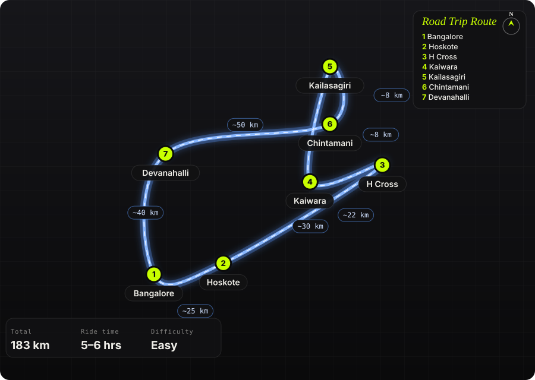

South India · India · Half day

<h1 class="rt-title">Kailasagiri Cave Temple &amp; Kaiwara</h1>

Bangalore → Hoskote → H Cross → Kaiwara (Bheema-Bakasura Betta, 500 steps) → Kailasagiri hand-cut cave temple → Chintamani → Devanahalli → Bangalore. ~180 km, a half-day loop east of the city.

cave templehillstepsday loopKolarmotorcycle

Distance<b>183 km</b>

Ride time<b>5–6 hrs</b>

Difficulty<b>Easy</b>

Best season<b>Oct – Feb</b>

Start<b>Bangalore</b>

The easy one in the collection: a Sunday loop east of Bangalore built around Kailasagiri, a hill outside Chintamani where a cave has been cut by hand into the rock and lined with shrines — Vallabha Ganapati, Chaturmukhalingeshwara and Jagadambe — reached by a short stone-paved walk you do barefoot. Pair it with Kaiwara, 7 km away, where the Bheema-Bakasura Betta climb (about 500 steps) earns a view over the Kolar plains. Go out on the Hoskote–H Cross road and come back through Devanahalli so you never repeat tarmac.

Route idea: @the_pretty_indian &amp; @gopravasa on Instagram — &#x27;50 km from Bengaluru — a cave temple, a hilltop view&#x27;; it&#x27;s nearer 75 km, but the point stands

## The route

Schematic map generated from waypoint coordinates — the shape follows the geography (compressed so long legs don't squash the loop), distances are labelled per leg. Not a navigation map. <a href="kailasagiri-kaiwara-ride-route.svg" download>Download the graphic</a>.

<h3>Leg by leg</h3>

<table class="rt-segs"><thead><tr><th>#</th><th>Leg</th><th>Dist</th><th>Notes</th></tr></thead><tbody><tr><td>1</td><td><b>Bangalore → Hoskote</b>
Old Madras Road (NH 75) to Hoskote
</td><td class="rt-km">25 km</td><td>The only dull bit; get it done before the traffic wakes up. tarmac</td></tr><tr><td>2</td><td><b>Hoskote → H Cross</b>
Hoskote – Sidlaghatta road to H Cross
</td><td class="rt-km">30 km</td><td>Two-lane state road through mulberry and grape country; watch for tractors and silk-cocoon lorries. tarmac</td></tr><tr><td>3</td><td><b>H Cross → Kaiwara</b>
H Cross – Kaiwara road
</td><td class="rt-km">22 km</td><td>Quiet rural road. Kaiwara is the Yogi Narayana ashram town; the Bheema-Bakasura Betta steps start behind it. tarmac</td></tr><tr><td>4</td><td><b>Kaiwara → Kailasagiri</b>
Kaiwara – Kailasagiri
</td><td class="rt-km">8 km</td><td>Short hop through the hills. Park at the base; the cave is a 10-minute walk up a stone path, barefoot. tarmac / stone path</td></tr><tr><td>5</td><td><b>Kailasagiri → Chintamani</b>
Kailasagiri – Chintamani
</td><td class="rt-km">8 km</td><td>Lunch stop. Chintamani has proper fuel and food. tarmac</td></tr><tr><td>6</td><td><b>Chintamani → Devanahalli</b>
Chintamani – Sidlaghatta – Devanahalli
</td><td class="rt-km">50 km</td><td>The return leg on a different road: open plateau, windmills on the ridges, very little traffic. tarmac</td></tr><tr><td>7</td><td><b>Devanahalli → Bangalore</b>
Devanahalli – Bangalore (NH 44)
</td><td class="rt-km">40 km</td><td>Fast airport highway home. tarmac</td></tr></tbody></table>

<h3>Highlights</h3><ul><li>Kailasagiri&#x27;s hand-cut cave — a low, cool tunnel through the rock with shrines set into the walls, unlike any other temple this close to the city.</li><li>Bheema-Bakasura Betta at Kaiwara — 500 steps to a rock summit with the Kolar plains laid out below; do it first, before the sun is up properly.</li><li>The Chintamani–Devanahalli plateau road — empty, straight, and lined with wind turbines.</li></ul>

<h3>Off-road &amp; motorcycling notes</h3>
<i class="on"></i><i class=""></i><i class=""></i><i class=""></i><i class=""></i>

Tarmac end to end. This is a road-bike loop; the only &#x27;trail&#x27; is the stone path at Kailasagiri and the steps at Kaiwara.
<ul><li>The stone path at Kailasagiri gets hot by midday — footwear comes off at the base, so carry socks or go early.</li><li>Rural roads have unmarked speed breakers at every village; hold 60 and look ahead.</li><li>Kaiwara&#x27;s steps are steep and uneven; not one for riding boots.</li></ul>

<h3>Timings, permits &amp; fuel</h3><ul><li>Kailasagiri cave temple is open through the day; go before 10 AM for cool stone and empty paths.</li><li>No permits or fees beyond small parking charges.</li><li>Fuel: Hoskote, Chintamani, Devanahalli — no gaps to worry about.</li></ul>

<h3>Cautions</h3><ul><li>Weekend crowds at Kaiwara ashram around festivals; the hill itself stays quiet.</li><li>The Hoskote stretch of NH 75 has heavy truck traffic — the earlier the better.</li></ul>

## Along the way

<figure><figcaption>View from Kailasagiri, Chintamani <a href="https://commons.wikimedia.org/wiki/File:Green_View_from_Kailasagiri_Chintamani_02.jpg" rel="noopener">Wikimedia Commons · free licence, see file page</a></figcaption></figure><figure><figcaption>Chintamani town <a href="https://commons.wikimedia.org/wiki/File:Chintamani_001.jpg" rel="noopener">Wikimedia Commons · free licence, see file page</a></figcaption></figure><figure><figcaption>Parshvanath Jain temple, Chintamani <a href="https://commons.wikimedia.org/wiki/File:Chintamani_Parshvanath_Jain_temple.jpg" rel="noopener">Wikimedia Commons · free licence, see file page</a></figcaption></figure>

## Sources &amp; further reading

<ul class="rt-sources"><li><a href="https://traveltwosome.com/kaiwara-kailasagiri-one-day-trip-guide/" rel="noopener">Kaiwara &amp; Kailasagiri one-day trip guide — Travel Twosome</a></li><li><a href="https://atmanirvana.com/chintamani-kailasagiri-cave-temple-kolar/" rel="noopener">Kailasagiri cave temple, Kolar — Atmanirvana</a></li></ul>

<a href="../">← All road trips</a>

