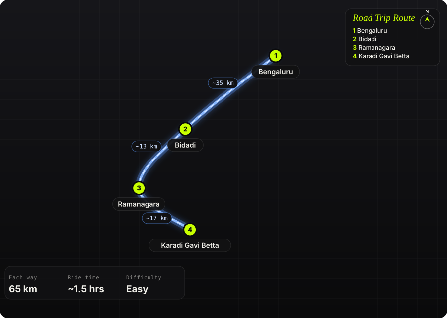

South India · India · Half day

<h1 class="rt-title">Karadi Gavi Betta</h1>

Bengaluru → Bidadi → Ramanagara → Karadi Gavi Betta. ~65 km, a granite rock face above a clear lake.

breakfast ridelakegraniteramanagaraeasy

Each way<b>65 km</b>

Ride time<b>~1.5 hrs</b>

Difficulty<b>Easy</b>

Best season<b>Oct – Feb</b>

Start<b>Bengaluru</b>

Karadi Gavi Betta sits near Avverahalli in Ramanagara taluk, a few hundred metres from SRS (Revanasiddeshwara) Betta. A large granite rock face drops to a lake with unusually clear water. It makes an easy Sunday breakfast ride: highway to Bidadi and Ramanagara, then quieter village roads south-east into the boulder country around SRS hills. Visitors come for the lake viewpoint, picnics, birdwatching and camping.

Route idea: @throughourboots on Instagram

## The route

Schematic map generated from waypoint coordinates — the shape follows the geography (compressed so long legs don't squash the loop), distances are labelled per leg. Not a navigation map. <a href="karadi-gavi-betta-route.svg" download>Download the graphic</a>.

<h3>Leg by leg</h3>

<table class="rt-segs"><thead><tr><th>#</th><th>Leg</th><th>Dist</th><th>Notes</th></tr></thead><tbody><tr><td>1</td><td><b>Bengaluru → Bidadi</b>
NH 275 (Bengaluru–Mysuru)
</td><td class="rt-km">35 km</td><td>Out of the city along Mysuru Road to Bidadi. Leave early to beat traffic. tarmac</td></tr><tr><td>2</td><td><b>Bidadi → Ramanagara</b>
NH 275 (Bengaluru–Mysuru)
</td><td class="rt-km">13 km</td><td>Highway run to Ramanagara with its granite hills alongside. tarmac</td></tr><tr><td>3</td><td><b>Ramanagara → Karadi Gavi Betta</b>
Village roads via Kailancha / Avverahalli
</td><td class="rt-km">17 km</td><td>Narrower rural roads through boulder country to the SRS Betta area. The last stretch may be broken. mixed</td></tr></tbody></table>

<h3>Highlights</h3><ul><li>A sheer granite rock face rising beside a clear-water lake</li><li>Lake viewpoint for a quiet breakfast or picnic, with good birdwatching</li><li>SRS (Revanasiddeshwara) Betta next door: about 300 steps cut into a monolith, climbed barefoot</li><li>A short ride that leaves the rest of Sunday free</li></ul>

<h3>Off-road &amp; motorcycling notes</h3>
<i class="on"></i><i class=""></i><i class=""></i><i class=""></i><i class=""></i>

Almost all tarmac. Only the final village approach may be rough or unpaved.
<ul><li>Any road bike can do it. Take the last few hundred metres slowly.</li><li>Park on firm ground, as the lakeshore can be soft after rain.</li></ul>

<h3>Timings, permits &amp; fuel</h3><ul><li>Leave Bengaluru by 6 am to reach for sunrise and breakfast</li><li>About 1.5 hrs each way</li><li>Allow 1–2 hrs at the lake, more if you also climb SRS Betta</li></ul>

<h3>Cautions</h3><ul><li>Don&#x27;t swim: the water is deep, there are no lifeguards, and drownings in lakes and quarry pits around Bengaluru are common</li><li>Stay back from the edge of the rock face, especially when it&#x27;s wet</li><li>No shops at the viewpoint. Carry water and food, and take your trash back</li><li>SRS Betta is a temple hill and must be climbed barefoot. The rock gets very hot by late morning.</li></ul>

## Along the way

<figure><figcaption>SRS hills near Karadi Gavi Betta, Ramanagara <a href="https://commons.wikimedia.org/wiki/File:SRS_hills%2C_Ramanagara.jpg" rel="noopener">Wikimedia Commons · free licence, see file page</a></figcaption></figure><figure><figcaption>Revanasiddeshwara Betta, a few hundred metres from the lake viewpoint <a href="https://commons.wikimedia.org/wiki/File:Revana_siddeshwara_Betta.JPG" rel="noopener">Wikimedia Commons · free licence, see file page</a></figcaption></figure>

## Sources &amp; further reading

<ul class="rt-sources"><li><a href="https://trekentrip.com/karadi-gavi-betta-and-lake-viewpoint/" rel="noopener">Karadi Gavi Betta and Lake Viewpoint – Treken Trip</a></li><li><a href="https://pankajsinghphotographie.com/underrated-day-outing-options-near-bangalore/" rel="noopener">Underrated day outing options near Bangalore – PankajSinghPhotographie</a></li><li><a href="https://www.trip.com/hotels/ramanagara-hotel-detail-122410662/q-mango-resort/" rel="noopener">Q Mango Resort, Ramanagara (address and nearby landmarks) – Trip.com</a></li><li><a href="https://en.wikipedia.org/wiki/Revanasiddeshwara_Betta" rel="noopener">Revanasiddeshwara Betta – Wikipedia</a></li><li><a href="https://muddietrails.com/experiences/srs-hills-trek-janapada-loka/" rel="noopener">SRS Hills Trek – Muddie Trails</a></li></ul>

<a href="../">← All road trips</a>

