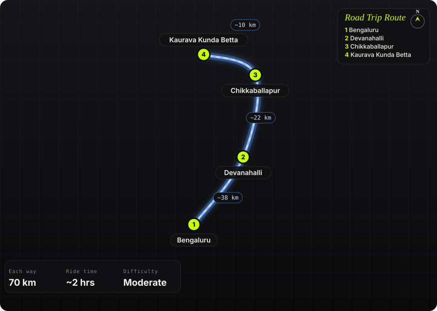

South India · India · Half day

<h1 class="rt-title">Kaurava Kunda Betta</h1>

Bengaluru → Devanahalli → Chikkaballapur → Kaurava Kunda. ~70 km, a granite twin hill near Isha Adiyogi with a short scramble to a 360° summit.

hilltrekgranitesunriseadiyoginh44

Each way<b>70 km</b>

Ride time<b>~2 hrs</b>

Difficulty<b>Moderate</b>

Best season<b>Oct – Feb</b>

Start<b>Bengaluru</b>

An easy NH 44 run north past Devanahalli and the Nandi Hills turn-off brings you to Kaurava Kunda, a rocky twin hill off the Isha Adiyogi road near Chikkaballapur. Local lore ties the twin peaks to the Kauravas and Pandavas of the Mahabharata. A path of sandy steps climbs to a small Shiva temple partway up, then granite slabs and scrub lead to an open summit plateau with views over Nandi Hills, Skandagiri and the Chikkaballapur plains. Riders have pushed ADV bikes onto the rock, but most people park at the base and walk.

Route idea: @trailson39t on Instagram

## The route

Schematic map generated from waypoint coordinates — the shape follows the geography (compressed so long legs don't squash the loop), distances are labelled per leg. Not a navigation map. <a href="kaurava-kunda-betta-route.svg" download>Download the graphic</a>.

<h3>Leg by leg</h3>

<table class="rt-segs"><thead><tr><th>#</th><th>Leg</th><th>Dist</th><th>Notes</th></tr></thead><tbody><tr><td>1</td><td><b>Bengaluru → Devanahalli</b>
NH 44 (Bellary Road / airport road)
</td><td class="rt-km">38 km</td><td>City exit and the fast, wide airport highway past Kempegowda Airport to Devanahalli. tarmac</td></tr><tr><td>2</td><td><b>Devanahalli → Chikkaballapur</b>
NH 44
</td><td class="rt-km">22 km</td><td>Four-lane highway past the Nandi Hills turn-off to Chikkaballapur. tarmac</td></tr><tr><td>3</td><td><b>Chikkaballapur → Kaurava Kunda Betta</b>
Isha Adiyogi road / village roads
</td><td class="rt-km">10 km</td><td>~10 km of smaller roads towards Isha Adiyogi; the last stretch to the trailhead is a village track. mixed</td></tr></tbody></table>

<h3>Highlights</h3><ul><li>Twin granite peaks tied by local legend to the Kauravas and Pandavas</li><li>Small Shiva temple and mantapa partway up the hill</li><li>360° summit plateau looking over Nandi Hills, Skandagiri and the Chikkaballapur plains</li><li>Pairs well with the 112 ft Adiyogi bust at Sadhguru Sannidhi, Avalagurki, a few km away</li></ul>

<h3>Off-road &amp; motorcycling notes</h3>
<i class="on"></i><i class="on"></i><i class=""></i><i class=""></i><i class=""></i>

The ride is paved almost to the base; the off-road part is the rock itself, which most riders walk rather than ride.
<ul><li>Approach to the trailhead is a short village track</li><li>Upper hill is open granite slab with loose sand, slippery even when dry</li><li>Riding onto the rock (as some ADV riders do) is technical and best left to experienced riders with a spotter</li></ul>

<h3>Timings, permits &amp; fuel</h3><ul><li>No formal entry fee is reported for independent visitors; commercial trek groups bundle &#x27;~forest permits&#x27; into their price, so check locally</li><li>Trek is ~5 km round trip, ~2–3 hrs up and down</li><li>Start from Bengaluru by ~5 am for sunrise on top; it gets hot and shadeless by late morning</li><li>Isha Adiyogi (Avalagurki) is open ~6 am – 8 pm, free entry, with the light show at ~7 pm</li></ul>

<h3>Cautions</h3><ul><li>Granite slabs dusted with sand are slippery — wear proper boots for the walk</li><li>Locals warn of leopards in the area; avoid going alone or after dark</li><li>No water on the trail — carry at least 1.5 litres per person</li><li>No drinking or smoking at the temple; carry your litter back</li></ul>

## Sources &amp; further reading

<ul class="rt-sources"><li><a href="https://www.tripoto.com/trip/trekking-destination-near-bangalore-kaurava-kunda-ride-trek-5d2757396c5ab" rel="noopener">Trekking Destination near Bangalore – Kaurava Kunda Ride &amp; Trek (Tripoto)</a></li><li><a href="https://www.adventurenation.com/trip/kaurava-kunda-night-trek" rel="noopener">Kaurava Kunda Night Trek (Adventure Nation)</a></li><li><a href="https://gochaarana.com/treks/kaurava-kunda-trek/" rel="noopener">Kaurava Kunda Trek (Go Chaarana)</a></li><li><a href="https://backpackersunited.in/tour/Kauravakunda-trek" rel="noopener">Kaurava Kunda Trek (Backpackers United)</a></li><li><a href="https://www.theweek.in/news/india/2023/01/10/vice-president-to-unveil-112-feet-adiyogi-statue-at-chikkaballap.amp.html" rel="noopener">Vice President to unveil 112-feet Adiyogi statue at Chikkaballapura (The Week)</a></li><li><a href="https://wanderlog.com/place/details/13556449/isha-foundation-chikkaballapura" rel="noopener">Isha Foundation Chikkaballapura (Wanderlog)</a></li><li><a href="https://www.trawell.in/karnataka/bangalore/isha-yoga-center-chikkaballapura" rel="noopener">Isha Yoga Center – Chikkaballapura (Trawell)</a></li><li><a href="https://en.wikipedia.org/wiki/Chikkaballapur" rel="noopener">Chikkaballapur (Wikipedia)</a></li></ul>

<a href="../">← All road trips</a>

