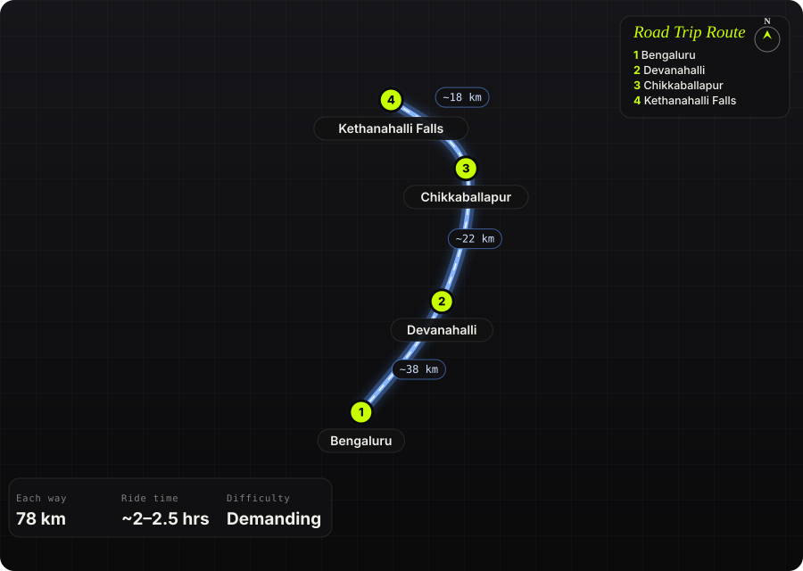

South India · India · Half day

<h1 class="rt-title">Kethanahalli Falls</h1>

Bengaluru → Devanahalli → Chikkaballapur → Kethanahalli Falls. ~78 km, a monsoon waterfall at the end of a rough rocky trail.

waterfalloffroadmonsoonadvtrail

Each way<b>78 km</b>

Ride time<b>~2–2.5 hrs</b>

Difficulty<b>Demanding</b>

Best season<b>Jul – Nov</b>

Start<b>Bengaluru</b>

Kethanahalli Falls, also called Vivekananda Falls, is a seasonal two-tier waterfall of roughly 90 ft tucked among the hills north of Chikkaballapur. The ride up NH 44 is easy highway; the fun starts past Kethanahalli village, where farm tracks give way to a moderately tough off-road trail of loose rock, steep ruts and slick patches. The falls only really run during and after the monsoon — outside that window you may find a dry rock face.

Route idea: @trailson39t on Instagram

## The route

Schematic map generated from waypoint coordinates — the shape follows the geography (compressed so long legs don't squash the loop), distances are labelled per leg. Not a navigation map. <a href="kethanahalli-falls-route.svg" download>Download the graphic</a>.

<h3>Leg by leg</h3>

<table class="rt-segs"><thead><tr><th>#</th><th>Leg</th><th>Dist</th><th>Notes</th></tr></thead><tbody><tr><td>1</td><td><b>Bengaluru → Devanahalli</b>
NH 44 (Bellary Road / airport road)
</td><td class="rt-km">38 km</td><td>City exit and the fast airport highway to Devanahalli. tarmac</td></tr><tr><td>2</td><td><b>Devanahalli → Chikkaballapur</b>
NH 44
</td><td class="rt-km">22 km</td><td>Four-lane highway past the Nandi Hills turn-off to Chikkaballapur. tarmac</td></tr><tr><td>3</td><td><b>Chikkaballapur → Kethanahalli Falls</b>
Village roads via Kethanahalli, then trail
</td><td class="rt-km">18 km</td><td>~17 km of rural roads to Kethanahalli village, then a rough trail of loose rock, steep ruts and slick ground; the last ~1 km to the falls is on foot. dirt</td></tr></tbody></table>

<h3>Highlights</h3><ul><li>Two-tier seasonal waterfall, ~90 ft, roaring in the monsoon</li><li>Ringed by the Nandi group of hills — Brahmagiri, Skandagiri, Divyagiri and others</li><li>A genuine off-road trail barely an hour and a half from the city</li><li>Countryside to rock-garden transition makes it good ADV practice</li></ul>

<h3>Off-road &amp; motorcycling notes</h3>
<i class="on"></i><i class="on"></i><i class="on"></i><i class=""></i><i class=""></i>

Moderately tough: loose rocks, steep rutted climbs and slick sections that get much harder when wet.
<ul><li>Trail is unmarked; locals in Kethanahalli are the best guide to the way in</li><li>Wet rock and mud in the monsoon — exactly when the falls flow — make it slippery</li><li>The final stretch to the falls is not rideable; park and walk ~1 km</li><li>Knobby or dual-sport tyres strongly recommended</li></ul>

<h3>Timings, permits &amp; fuel</h3><ul><li>Free entry; usually listed as ~7 am – 5 pm</li><li>Falls flow only during and shortly after the monsoon (roughly Jun – Oct/Nov); can be dry otherwise</li><li>Fuel up in Chikkaballapur — nothing beyond the town</li><li>No food at the falls; eat in Chikkaballapur</li></ul>

<h3>Cautions</h3><ul><li>Risky solo — ride with at least one other bike</li><li>Leopards and sloth bears are reported in the surrounding hills; don&#x27;t linger after dusk</li><li>Flash flow after heavy rain — stay off the rocks at the lip of the falls</li><li>Carry out all litter</li></ul>

## Sources &amp; further reading

<ul class="rt-sources"><li><a href="https://www.trawell.in/karnataka/bangalore/vivekananda-falls-kethanahalli-falls" rel="noopener">Vivekananda Falls / Kethanahalli Falls (Trawell)</a></li><li><a href="https://www.tripoto.com/karnataka/trips/kethenahalli-waterfalls-insane-trek-56fe3b0475c71" rel="noopener">Kethenahalli waterfalls insane trek (Tripoto)</a></li><li><a href="https://wanderlog.com/place/details/7133770/kethanahalli-falls" rel="noopener">Kethanahalli Falls (Wanderlog)</a></li><li><a href="https://en.wikipedia.org/wiki/Chikkaballapur" rel="noopener">Chikkaballapur (Wikipedia)</a></li></ul>

<a href="../">← All road trips</a>

