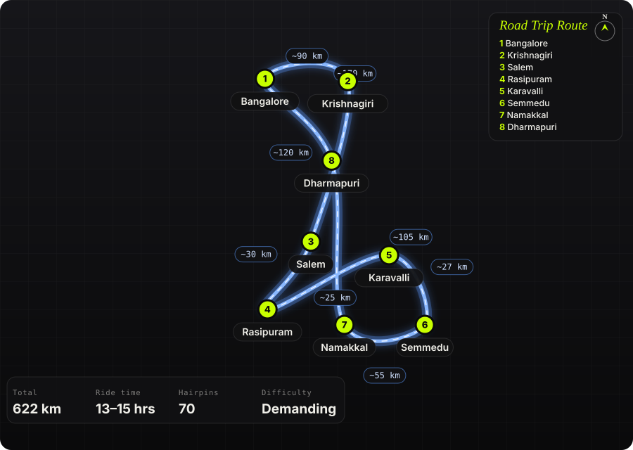

South India · India · 2 days

<h1 class="rt-title">Kolli Hills — 70 Hairpins</h1>

Bangalore → Krishnagiri → Salem → Rasipuram → Karavalli → 70 continuous hairpins to Semmedu → Agaya Gangai falls → Namakkal → Dharmapuri → Bangalore. ~620 km over two days to the &#x27;Mountain of Death&#x27;.

hairpinsEastern GhatswaterfalltempleweekendTamil Nadumotorcycle

Distance<b>622 km</b>

Ride time<b>13–15 hrs</b>

Hairpins<b>70</b>

Difficulty<b>Demanding</b>

Best season<b>Sep – Feb</b>

Start<b>Bangalore</b>

Kolli Malai in the Eastern Ghats is named for Kolli Paavai, the goddess said to guard the hill with an unforgiving hand — and the ghat road from Karavalli is her handiwork: 70 numbered hairpins in 27 km, stacked on top of each other so tightly the drone shots look fake. On top it&#x27;s a different world: jackfruit and coffee, the Arapaleeswarar temple, and Agaya Gangai, a 300-foot fall reached by a thousand steps down (and back up). Out via Salem, back via Namakkal so you ride the hairpins once each way and never repeat road.

Route idea: @walterwhite007 on Instagram — &#x27;Feeling brave? Kolli Hills, Tamil Nadu — also called The Mountain of Death&#x27;

## The route

Schematic map generated from waypoint coordinates — the shape follows the geography (compressed so long legs don't squash the loop), distances are labelled per leg. Not a navigation map. <a href="kolli-hills-70-hairpins-route.svg" download>Download the graphic</a>.

<h3>Leg by leg</h3>

<table class="rt-segs"><thead><tr><th>#</th><th>Leg</th><th>Dist</th><th>Notes</th></tr></thead><tbody><tr><td>1</td><td><b>Bangalore → Krishnagiri</b>
NH 44 via Hosur to Krishnagiri
</td><td class="rt-km">90 km</td><td>Day 1. Six-lane; leave by 5 AM to clear Hosur before the trucks. tarmac</td></tr><tr><td>2</td><td><b>Krishnagiri → Salem</b>
NH 44 Krishnagiri – Dharmapuri – Salem
</td><td class="rt-km">120 km</td><td>Fast and dull; breakfast at Dharmapuri. Fuel in Salem. tarmac</td></tr><tr><td>3</td><td><b>Salem → Rasipuram</b>
Salem – Rasipuram (NH 44 / SH)
</td><td class="rt-km">30 km</td><td>Silk-weaving town; last proper shops before the hill. tarmac</td></tr><tr><td>4</td><td><b>Rasipuram → Karavalli</b>
Rasipuram → Sendamangalam → Karavalli
</td><td class="rt-km">25 km</td><td>Two-lane through paddy to the base of the ghat. Top up here — nothing on the climb. tarmac</td></tr><tr><td>5</td><td><b>Karavalli → Semmedu</b>
Karavalli – Semmedu ghat road
</td><td class="rt-km">27 km</td><td>The 70 hairpins, numbered on stone markers. Bends 15, 21, 35, 52 and 66 are the tight, blind ones. 40–60 minutes if you don&#x27;t stop; you will stop. 70 hairpins tarmac</td></tr><tr><td>6</td><td><b>Semmedu → Namakkal</b>
Semmedu → Arapaleeswarar temple → Agaya Gangai → down the Senthamangalam side → Namakkal
</td><td class="rt-km">55 km</td><td>Day 2. Falls are a 1,000-step descent from the temple car park — budget two hours. The Namakkal-side descent is gentler and the road down is better surfaced. tarmac</td></tr><tr><td>7</td><td><b>Namakkal → Dharmapuri</b>
Namakkal – Salem – Dharmapuri (NH 44)
</td><td class="rt-km">105 km</td><td>Namakkal fort and the Anjaneyar statue if you want a stop; otherwise the highway north. tarmac</td></tr><tr><td>8</td><td><b>Dharmapuri → Bangalore</b>
Dharmapuri – Krishnagiri – Hosur – Bangalore
</td><td class="rt-km">170 km</td><td>Home. Hosur toll traffic after 5 PM is the last obstacle. tarmac</td></tr></tbody></table>

<h3>Highlights</h3><ul><li>The Karavalli ghat — 70 hairpins in 27 km, the densest sequence of bends in South India, with the plains dropping away behind every third turn.</li><li>Agaya Gangai — a 300 ft waterfall in a gorge below the Arapaleeswarar temple; the thousand steps back up are the real workout of the trip.</li><li>Seekuparai and Selur Nadu viewpoints — the plateau&#x27;s edge, 1,000 m straight down to the Namakkal plains.</li><li>Vasalurpatty boat house and the Semmedu botanical garden for the lazy afternoon in between.</li><li>Namakkal fort on the way home — a hill fort on a single rock in the middle of the town.</li></ul>

<h3>Off-road &amp; motorcycling notes</h3>
<i class="on"></i><i class=""></i><i class=""></i><i class=""></i><i class=""></i>

All tarmac, but the ghat is the point. Seventy hairpins on a road that buses, tempo travellers and coffee lorries share; the riding challenge is line discipline, not surface.
<ul><li>Hairpins are tight enough that a bus takes the entire road — stop before the apex if you hear a horn, don&#x27;t try to squeeze.</li><li>Gravel washes onto the inside line at the numbered bends after rain; brake before, not in, the corner.</li><li>Fog sits on the top 20 hairpins in the early morning Nov–Jan — headlight on, visibility can drop to 20 m.</li><li>Descending the same road is harder than climbing it: engine braking, second gear, and rest the brakes at the viewpoints.</li><li>Agaya Gangai steps are steep and wet — trainers in the bag; riding boots will hurt.</li></ul>

<h3>Timings, permits &amp; fuel</h3><ul><li>Arapaleeswarar temple: 6 AM – 12 PM and 4 – 7 PM. Agaya Gangai path is open 24 hours but do the steps only in daylight.</li><li>Boat house 6 AM – 6 PM (₹5, life jackets mandatory). Botanical garden 8 AM – 8 PM (₹20).</li><li>No permits or ghat closures; the road is open at night but fog and unlit bends make that a bad idea.</li><li>Fuel: Salem, Rasipuram, Sendamangalam, Semmedu (one pump on top), Namakkal. Fill at Rasipuram before the climb.</li><li>Stay: TTDC and homestays around Semmedu and Solakadu; book ahead in Dec–Jan.</li></ul>

<h3>Cautions</h3><ul><li>The &#x27;Mountain of Death&#x27; name is folklore, but the accident record on the ghat is real — mostly overtaking on blind bends. Don&#x27;t.</li><li>Monsoon (Jun–Aug) brings landslides on the Karavalli side; the road has been closed for weeks at a time.</li><li>Namakkal-side road (Senthamangalam) is the easier descent if you&#x27;re tired on day 2.</li><li>Day 1 is 290 km plus the ghat; don&#x27;t attempt it as a one-day return — it has been done, and it&#x27;s the riders who do that who end up in the folklore.</li></ul>

## Along the way

<figure><figcaption>Agaya Gangai falls, Kolli Hills <a href="https://commons.wikimedia.org/wiki/File:Agaya_Gangai.JPG" rel="noopener">Wikimedia Commons · free licence, see file page</a></figcaption></figure><figure><figcaption>Agaya Gangai in full flow <a href="https://commons.wikimedia.org/wiki/File:Agayagangai-at-kollimalai.JPG" rel="noopener">Wikimedia Commons · free licence, see file page</a></figcaption></figure><figure><figcaption>Cloud over the Eastern Ghats <a href="https://commons.wikimedia.org/wiki/File:Clouds_over_eastern_ghats_at_Boyapalem.JPG" rel="noopener">Wikimedia Commons · free licence, see file page</a></figcaption></figure><figure><figcaption>Namakkal fort on the way home <a href="https://commons.wikimedia.org/wiki/File:Namakkal_Fort_%282%29.jpg" rel="noopener">Wikimedia Commons · free licence, see file page</a></figcaption></figure><figure><figcaption>The Shevaroy hills near Salem — Kolli&#x27;s neighbour across the plain <a href="https://commons.wikimedia.org/wiki/File:Yercaud_hills.jpg" rel="noopener">Wikimedia Commons · free licence, see file page</a></figcaption></figure>

## Sources &amp; further reading

<ul class="rt-sources"><li><a href="https://mandakashayam.com/kollimalai-a-complete-travel-guide-to-kolli-hills/" rel="noopener">Kolli Hills ghat road guide — Mandakashayam</a></li><li><a href="https://www.beontheroad.com/2010/10/70-continuous-hairpin-bends-of-kolli.html" rel="noopener">70 continuous hairpin bends of Kolli Malai — Be On The Road</a></li><li><a href="https://www.dangerousroads.org/asia/india/3311-kolli-hills-road.html" rel="noopener">Kolli Hills road — Dangerous Roads</a></li></ul>

<a href="../">← All road trips</a>

