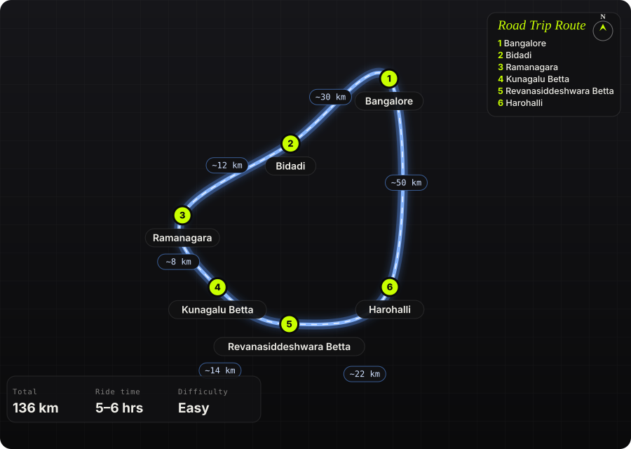

South India · India · Half day (start 4:30 AM)

<h1 class="rt-title">Kunagalu Betta Dawn Ride</h1>

Bangalore → Bidadi → Ramanagara → Kunagalu Betta (sunrise trek through a bat cave) → Revanasiddeshwara Betta → Harohalli → Bangalore. ~135 km, out before dawn, back for lunch.

sunrisecavetrekgraniteRamanagarahalf daymotorcycle

Distance<b>136 km</b>

Ride time<b>5–6 hrs</b>

Difficulty<b>Easy</b>

Best season<b>Oct – Mar</b>

Start<b>Bangalore</b>

A pre-dawn sprint down Mysore Road to Ramanagara, then a left onto the Kanakapura road to Kunagalu Betta — a granite hillock 2 km out of town with an ancient Nandi halfway up, a pitch-black cave you crawl through with a torch, and a Hanuman temple on the summit. Thirty minutes up, sunrise over the Sholay boulders, thirty minutes down. The return avoids the highway entirely: Revanasiddeshwara&#x27;s monolith temple, then village roads across to Harohalli and the Kanakapura road home.

Route idea: @the_vextro on Instagram — &#x27;Kunagalu Betta ride — unexpected&#x27; — a night ride out of Bangalore to the hill

## The route

Schematic map generated from waypoint coordinates — the shape follows the geography (compressed so long legs don't squash the loop), distances are labelled per leg. Not a navigation map. <a href="kunagalu-betta-dawn-ride-route.svg" download>Download the graphic</a>.

<h3>Leg by leg</h3>

<table class="rt-segs"><thead><tr><th>#</th><th>Leg</th><th>Dist</th><th>Notes</th></tr></thead><tbody><tr><td>1</td><td><b>Bangalore → Bidadi</b>
Mysore Road / NH 275 to Bidadi
</td><td class="rt-km">30 km</td><td>Empty at 4:30 AM. Fuel at the Bidadi pumps if the tank is low. tarmac</td></tr><tr><td>2</td><td><b>Bidadi → Ramanagara</b>
NH 275 to Ramanagara
</td><td class="rt-km">12 km</td><td>Boulders start to loom out of the dark on both sides. tarmac</td></tr><tr><td>3</td><td><b>Ramanagara → Kunagalu Betta</b>
Ramanagara – Kanakapura road, left to Kunagalu
</td><td class="rt-km">8 km</td><td>Park at the base of the hillock. Muddy trail to the Nandi, then the cave, then the summit — 30 min up. tarmac / mud trail</td></tr><tr><td>4</td><td><b>Kunagalu Betta → Revanasiddeshwara Betta</b>
Kanakapura road to Revanasiddeshwara Betta
</td><td class="rt-km">14 km</td><td>Monolith hill with the cave temple; motorable road most of the way, a few steps to the shrine. tarmac</td></tr><tr><td>5</td><td><b>Revanasiddeshwara Betta → Harohalli</b>
Village roads Revanasiddeshwara → Harohalli
</td><td class="rt-km">22 km</td><td>Single-lane roads through farmland — this is the bit worth the detour. Navigate by map; some stretches are broken. narrow tarmac / broken</td></tr><tr><td>6</td><td><b>Harohalli → Bangalore</b>
Harohalli – Kanakapura Road (NH 948) – Bangalore
</td><td class="rt-km">50 km</td><td>Wide and quick. Breakfast at one of the Kanakapura Road dhabas. tarmac</td></tr></tbody></table>

<h3>Highlights</h3><ul><li>Sunrise from the Hanuman temple on Kunagalu Betta, with Ramadevara Betta and the whole boulder field lit up gold.</li><li>The cave stretch — cold, dark, smells of bats, and drops you out just below the summit.</li><li>Revanasiddeshwara Betta&#x27;s cave shrine on a single monolith, usually empty at 8 AM.</li><li>The village road across to Harohalli instead of the highway back through Ramanagara.</li></ul>

<h3>Off-road &amp; motorcycling notes</h3>
<i class="on"></i><i class=""></i><i class=""></i><i class=""></i><i class=""></i>

Tarmac with a muddy trek. The only riding challenge is the broken village road between Revanasiddeshwara and Harohalli.
<ul><li>Kunagalu trail is loose soil and rock — fine in trainers, miserable in riding boots. Swap at the bike.</li><li>Bring a proper torch for the cave; a phone light is not enough and the floor is uneven.</li><li>The Revanasiddeshwara–Harohalli road has potholes and cattle at every village; keep it under 50.</li></ul>

<h3>Timings, permits &amp; fuel</h3><ul><li>No entry fee or permit; park at the base of Kunagalu Betta. Trailhead is unmarked — locals will point.</li><li>Leave Bangalore by 4:30 AM to be on the summit for a 6:15 sunrise.</li><li>Fuel: Bidadi, Ramanagara, Harohalli. Nothing needed in between.</li></ul>

<h3>Cautions</h3><ul><li>Riding NH 275 in the dark: watch for trucks stopped on the shoulder without lights.</li><li>The cave section is not for anyone claustrophobic; there&#x27;s a walk-around.</li><li>Summer (Mar–May) makes the bare granite brutal by 9 AM — be off the hill by then.</li></ul>

## Along the way

<figure><figcaption>Granite boulders around Ramanagara <a href="https://commons.wikimedia.org/wiki/File:Ramanagara_Hills_%2810306067976%29.jpg" rel="noopener">Wikimedia Commons · free licence, see file page</a></figcaption></figure><figure><figcaption>Revanasiddeshwara Betta monolith <a href="https://commons.wikimedia.org/wiki/File:Revana_siddeshwara_Betta.JPG" rel="noopener">Wikimedia Commons · free licence, see file page</a></figcaption></figure><figure><figcaption>Revanasiddeshwara temple <a href="https://commons.wikimedia.org/wiki/File:Revanasiddeshwara_temple.jpg" rel="noopener">Wikimedia Commons · free licence, see file page</a></figcaption></figure><figure><figcaption>SRS hills, Ramanagara <a href="https://commons.wikimedia.org/wiki/File:SRS_hills%2C_Ramanagara.jpg" rel="noopener">Wikimedia Commons · free licence, see file page</a></figcaption></figure>

## Sources &amp; further reading

<ul class="rt-sources"><li><a href="https://www.theloapers.com/2026/05/kunagalu-betta-trek-ramanagara-cave.html" rel="noopener">Kunagalu Betta trek — The Loapers (May 2026)</a></li><li><a href="https://ramanagara.nic.in/en/places-of-interest/" rel="noopener">Places of interest — Ramanagara district administration</a></li></ul>

<a href="../">← All road trips</a>

