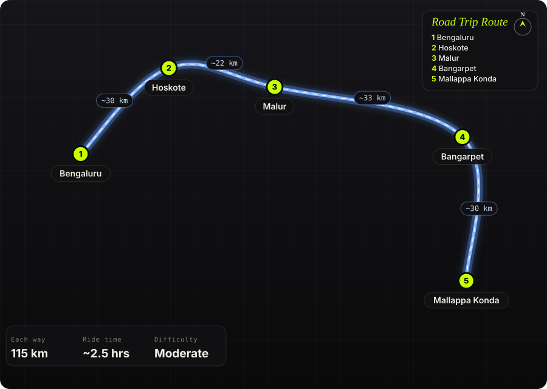

South India · India · 1 day

<h1 class="rt-title">Mallappa Konda</h1>

Bengaluru → Hoskote → Malur → Bangarpet → Mallappa Konda. ~115 km, a ~4 km hairpin ghat to a tri-state viewpoint.

hairpinsghat roadviewpointtempletri-stateandhra pradesh

Each way<b>115 km</b>

Ride time<b>~2.5 hrs</b>

Difficulty<b>Moderate</b>

Best season<b>Oct – Feb</b>

Start<b>Bengaluru</b>

Mallappa Konda is a ~1,090 m hill in the Eastern Ghats in Gudupalle mandal near Kuppam, Andhra Pradesh, close to where Karnataka, Andhra Pradesh and Tamil Nadu meet. The ride runs east through Kolar district&#x27;s farmland and lakes past Bangarpet, then climbs a ~4 km stretch of tight switchbacks to a small Malleswara Swamy shrine on top. The summit has wide views over all three states and no shops or fencing, so it stays quiet and unspoilt.

Route idea: @twoofusonwheels on Instagram

## The route

Schematic map generated from waypoint coordinates — the shape follows the geography (compressed so long legs don't squash the loop), distances are labelled per leg. Not a navigation map. <a href="mallappa-konda-route.svg" download>Download the graphic</a>.

<h3>Leg by leg</h3>

<table class="rt-segs"><thead><tr><th>#</th><th>Leg</th><th>Dist</th><th>Notes</th></tr></thead><tbody><tr><td>1</td><td><b>Bengaluru → Hoskote</b>
NH75 (Old Madras Road)
</td><td class="rt-km">30 km</td><td>City exit east through KR Puram to Hoskote; heavy traffic unless you leave early. tarmac</td></tr><tr><td>2</td><td><b>Hoskote → Malur</b>
Hoskote–Malur road
</td><td class="rt-km">22 km</td><td>Two-lane country road through farmland. tarmac</td></tr><tr><td>3</td><td><b>Malur → Bangarpet</b>
Malur–Bangarpet road
</td><td class="rt-km">33 km</td><td>Rural Kolar district stretch past fields and lakes. tarmac</td></tr><tr><td>4</td><td><b>Bangarpet → Mallappa Konda</b>
Village roads via Kamasamudram, then the ghat
</td><td class="rt-km">30 km</td><td>Quiet roads into Andhra Pradesh, a short rough patch, then ~4 km of hairpins up to the top. mixed</td></tr></tbody></table>

<h3>Highlights</h3><ul><li>~4 km of tight switchbacks climbing the ridge</li><li>Summit views where Karnataka, Andhra Pradesh and Tamil Nadu meet</li><li>Small Malleswara Swamy shrine at the top</li><li>Paddy fields and lakes along the approach through Kolar district</li></ul>

<h3>Off-road &amp; motorcycling notes</h3>
<i class="on"></i><i class=""></i><i class=""></i><i class=""></i><i class=""></i>

Almost all tarmac; the ghat itself is paved, with only a short rough patch on the approach.
<ul><li>A rider reports roughly 100 m of broken road before the climb</li><li>Ghat road from the foothill to the top was described as in good shape</li><li>Any bike handles it; tight hairpins reward smooth low-gear riding</li></ul>

<h3>Timings, permits &amp; fuel</h3><ul><li>Leave Bengaluru by ~6 AM to clear Old Madras Road traffic</li><li>Shrine has no fixed hours; visit between sunrise and sunset</li><li>Sunrise and late afternoon give the best light and views</li></ul>

<h3>Cautions</h3><ul><li>No shops, food or water at the top; carry your own</li><li>Google Maps may suggest poor shortcuts on the village roads; stick to main roads</li><li>No fencing at the summit edges</li><li>Crossing into Andhra Pradesh: fuel up in Karnataka before Bangarpet</li></ul>

## Sources &amp; further reading

<ul class="rt-sources"><li><a href="https://www.tripoto.com/trip/mallappa-konda-view-point-confluence-of-3-south-indian-states-616fc0736cad8" rel="noopener">Mallappa Konda View Point: Confluence of 3 South Indian States (Tripoto)</a></li><li><a href="https://peakvisor.com/peak/mallapa-konda.html" rel="noopener">Mallapa Konda (1,091 m) – PeakVisor</a></li><li><a href="https://blog.dharmikvibes.com/p/mallappa-konda-shivling-the-sacred-tri-state-confluence" rel="noopener">Mallappa Konda Shivling – Dharmik Vibes</a></li><li><a href="https://www.youtube.com/watch?v=zIx8ZN9OzIw" rel="noopener">Must Visit Viewpoint Near Bengaluru under 100 km | Mallappa Konda Hills (YouTube)</a></li></ul>

<a href="../">← All road trips</a>

