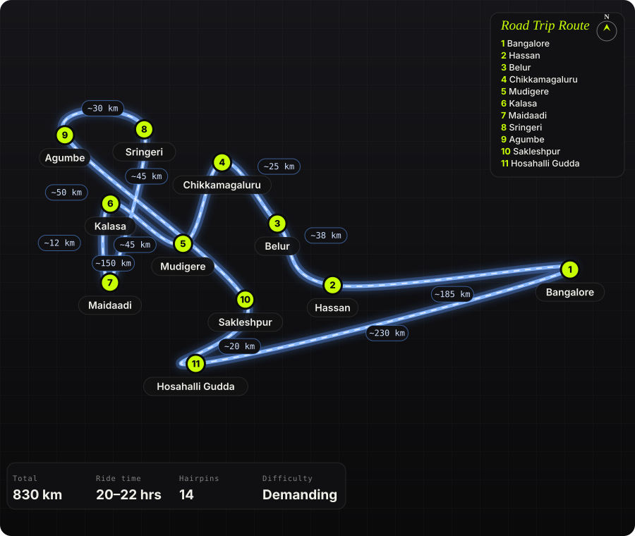

South India · India · 3 days

<h1 class="rt-title">Malnad Grand Loop</h1>

Bangalore → Hassan → Belur → Chikkamagaluru → Mudigere → Kalasa → Maidaadi sunset viewpoint → Sringeri → Agumbe → Sakleshpur → Hosahalli Gudda → Bangalore. ~830 km over 3 days through coffee, shola grassland and the wettest ghats in Karnataka.

Western Ghatscoffee estatesgrasslandsunset viewpointdirt trackAgumbe ghatmulti-daymotorcycle

Distance<b>830 km</b>

Ride time<b>20–22 hrs</b>

Hairpins<b>14</b>

Difficulty<b>Demanding</b>

Best season<b>Sep – Jan</b>

Start<b>Bangalore</b>

Three days that cover everything the Instagram tier-lists argue about — Chikkamagaluru (fine), Mudigere (better), Kalasa and Agumbe (the S-tier). Out via the Hassan–Belur highway, then the road gets interesting: the Charmadi-side climb to Mudigere, the Kalasa valley with the Maidaadi ridge above it for sunset, Sringeri&#x27;s temple town, and Agumbe&#x27;s 14-hairpin ghat with the Arabian Sea on the horizon. Home via Sakleshpur and the dirt track up Hosahalli Gudda, the grassland &#x27;shooting point&#x27; every reel is filmed on. Two proper dirt sections, one long trek, and more coffee than is sensible.

Route idea: @offbeatatlas, @mud_travellers, @ka13traveller_ and a Google Maps pin for Maidaadi — four separate reels — the Bengaluru→Chikkamagaluru route card, the Malnad tier list, Hosahalli Gudda, and the Maidaadi viewpoint — stitched into one loop

## The route

Schematic map generated from waypoint coordinates — the shape follows the geography (compressed so long legs don't squash the loop), distances are labelled per leg. Not a navigation map. <a href="malnad-grand-loop-route.svg" download>Download the graphic</a>.

<h3>Leg by leg</h3>

<table class="rt-segs"><thead><tr><th>#</th><th>Leg</th><th>Dist</th><th>Notes</th></tr></thead><tbody><tr><td>1</td><td><b>Bangalore → Hassan</b>
NH 75 via Nelamangala → Yediyur → Channarayapatna → Hassan
</td><td class="rt-km">185 km</td><td>Day 1. Four-lane and fast; breakfast at Yediyur. The reel&#x27;s 30/65/50/40 km splits are about right. tarmac</td></tr><tr><td>2</td><td><b>Hassan → Belur</b>
Hassan – Belur (SH 21)
</td><td class="rt-km">38 km</td><td>Chennakeshava temple — 20 minutes for the carvings is worth it even on a bike trip. tarmac</td></tr><tr><td>3</td><td><b>Belur → Chikkamagaluru</b>
Belur – Chikkamagaluru
</td><td class="rt-km">25 km</td><td>Coffee begins. Chikkamagaluru is fuel, lunch, and the turn towards the hills; Mullayanagiri is a 20 km detour if you want the state&#x27;s highest road. tarmac</td></tr><tr><td>4</td><td><b>Chikkamagaluru → Mudigere</b>
Chikkamagaluru → Aldur → Mudigere
</td><td class="rt-km">45 km</td><td>Estate roads, shaded, twisty, and quiet. Night 1 in a Mudigere homestay. tarmac</td></tr><tr><td>5</td><td><b>Mudigere → Kalasa</b>
Mudigere → Kottigehara → Kalasa
</td><td class="rt-km">45 km</td><td>Day 2. The Charmadi junction at Kottigehara, then the valley road into Kalasa with Kudremukh on the skyline. tarmac</td></tr><tr><td>6</td><td><b>Kalasa → Maidaadi</b>
Kalasa – Kanive road to Maidaadi
</td><td class="rt-km">12 km</td><td>Narrow estate road, then a rough final stretch to the ridge. Time it for sunset — arrive 30 min early. narrow tarmac / rough track</td></tr><tr><td>7</td><td><b>Maidaadi → Sringeri</b>
Maidaadi → Kalasa → Horanadu → Sringeri
</td><td class="rt-km">50 km</td><td>Night 2 in Sringeri. The Horanadu road runs along the Bhadra through thick forest. tarmac, broken patches</td></tr><tr><td>8</td><td><b>Sringeri → Agumbe</b>
Sringeri – Agumbe
</td><td class="rt-km">30 km</td><td>Day 3. Agumbe&#x27;s 14 hairpins drop towards the coast — ride to the sunset point and come back up; it is the best ghat in this part of the state. 14 hairpins tarmac</td></tr><tr><td>9</td><td><b>Agumbe → Sakleshpur</b>
Agumbe → Koppa → Balehonnur → Kottigehara → Sakleshpur
</td><td class="rt-km">150 km</td><td>The long interior road back east: estate after estate, almost no traffic, fuel at Koppa and Kottigehara. tarmac, patchy</td></tr><tr><td>10</td><td><b>Sakleshpur → Hosahalli Gudda</b>
Sakleshpur – Hosahalli village (Bisle road)
</td><td class="rt-km">20 km</td><td>Turn off the Bisle Ghat road for the shooting point. Last 2 km is rough dirt; locals have dug trenches across the final few hundred metres. dirt track</td></tr><tr><td>11</td><td><b>Hosahalli Gudda → Bangalore</b>
Sakleshpur – Hassan – NH 75 – Bangalore
</td><td class="rt-km">230 km</td><td>Home run. Dinner at Hassan, then the highway. tarmac</td></tr></tbody></table>

<h3>Highlights</h3><ul><li>Maidaadi ridge at sunset — an unfenced grass edge above the Kalasa valley with cloud pouring through the gaps in the Kudremukh range.</li><li>Agumbe ghat — 14 hairpins through rainforest, with the sunset viewpoint at the top looking straight out to the Arabian Sea.</li><li>Hosahalli Gudda&#x27;s grassland dirt track — the one from the reel, a bare ridge of green with a broken watchtower on top.</li><li>Belur&#x27;s Chennakeshava temple and Sringeri&#x27;s Sharada Peetham — two stops that give the loop a spine beyond coffee.</li><li>The Agumbe–Koppa–Balehonnur interior road: 150 km of estate roads with nobody on them.</li></ul>

<h3>Off-road &amp; motorcycling notes</h3>
<i class="on"></i><i class="on"></i><i class="on"></i><i class=""></i><i class=""></i>

Mostly narrow estate tarmac with two dirt sections that decide what bike you bring: the rough track up to Maidaadi and the 2 km of dug-up dirt at Hosahalli Gudda. An ADV does both; a road bike walks the last kilometre of each.
<ul><li>Hosahalli Gudda: the final 200–300 m has deliberate trenches — even 4x4s stop. Park where the track turns bad and walk. The watchtower has no proper steps; don&#x27;t climb it in riding gear.</li><li>Maidaadi approach: red-soil track with ruts; slick after rain. Ride up in daylight so you know the line for the descent in the dark after sunset.</li><li>Agumbe ghat: moss on the shaded hairpins even in dry months, and the buses use the whole road. Downhill in second gear.</li><li>The Horanadu–Sringeri and Balehonnur roads have monsoon damage every year; expect gravel in the corners through November.</li><li>Luggage: soft bags — you&#x27;ll be walking with them at homestays without parking, and hard cases catch on estate gates.</li></ul>

<h3>Timings, permits &amp; fuel</h3><ul><li>Maidaadi has no formal timings or fee; Google lists 8 AM opening. Reviewers say arrive 30 minutes before sunset and note there is no fencing at the edge.</li><li>Hosahalli Gudda: no gate or fee at the time of writing; allow 1–1.5 hours from Sakleshpur including the walk.</li><li>Belur temple: 7:30 AM – 7:30 PM. Sringeri temple closes for the afternoon (roughly 2–4 PM).</li><li>Fuel: Hassan, Chikkamagaluru, Mudigere, Kalasa, Sringeri, Koppa, Kottigehara, Sakleshpur — never more than 60 km between pumps.</li><li>Book Mudigere and Sringeri stays ahead on long weekends; Kalasa homestays fill for Horanadu pilgrims.</li></ul>

<h3>Cautions</h3><ul><li>Agumbe gets over 7,000 mm of rain a year — Jun–Sep the ghat is fog, landslides and leeches. Ride it Oct–Jan.</li><li>Elephants cross the Sakleshpur–Bisle road and the Mudigere–Kottigehara stretch at dusk. Don&#x27;t ride the estate roads after dark.</li><li>Maidaadi ridge is unfenced; the drop is real and the grass hides the edge in mist.</li><li>Day 3 is 430 km with a trek in the middle — start Agumbe at first light or split it with a night in Sakleshpur.</li></ul>

## Along the way

<figure><figcaption>Kudremukh range above the Kalasa valley <a href="https://commons.wikimedia.org/wiki/File:Kudremukh_National_Park.jpg" rel="noopener">Wikimedia Commons · free licence, see file page</a></figcaption></figure><figure><figcaption>Agumbe rainforest <a href="https://commons.wikimedia.org/wiki/File:Agumbe_Banner.jpg" rel="noopener">Wikimedia Commons · free licence, see file page</a></figcaption></figure><figure><figcaption>Chennakeshava temple, Belur <a href="https://commons.wikimedia.org/wiki/File:Chennakeshava_Temple%2C_Belur_%2850358426721%29.jpg" rel="noopener">Wikimedia Commons · free licence, see file page</a></figcaption></figure><figure><figcaption>Kalaseshwara temple, Kalasa <a href="https://commons.wikimedia.org/wiki/File:Kalaseshwara_Temple%2C_Kalasa.jpg" rel="noopener">Wikimedia Commons · free licence, see file page</a></figcaption></figure><figure><figcaption>From Mullayanagiri — the optional detour above Chikkamagaluru <a href="https://commons.wikimedia.org/wiki/File:View_from_the_top_of_mullayanagiri_peak.jpg" rel="noopener">Wikimedia Commons · free licence, see file page</a></figcaption></figure><figure><figcaption>Shola grassland in the Kudremukh hills <a href="https://commons.wikimedia.org/wiki/File:Mountains_of_Kudremukh.jpg" rel="noopener">Wikimedia Commons · free licence, see file page</a></figcaption></figure><figure><figcaption>Lakya dam, Kudremukh <a href="https://commons.wikimedia.org/wiki/File:Kudremukh_Lakya_dam_lake.jpg" rel="noopener">Wikimedia Commons · free licence, see file page</a></figcaption></figure>

## Sources &amp; further reading

<ul class="rt-sources"><li><a href="https://bynekaadu.com/the-magic-of-sunset-at-maidaadi-sunset-viewpoint/" rel="noopener">Maidaadi sunset viewpoint — Bynekaadu</a></li><li><a href="https://www.enidhi.net/2024/01/hosahalli-gudda-shooting-point.html" rel="noopener">Hosahalli Gudda shooting point — eNidhi India</a></li><li><a href="https://www.sarathythetraveler.com/2021/08/monsoon-drive-to-hosahalli-gutta-and.html" rel="noopener">Monsoon drive to Hosahalli Gudda — Sarathy the Traveler</a></li></ul>

<a href="../">← All road trips</a>

