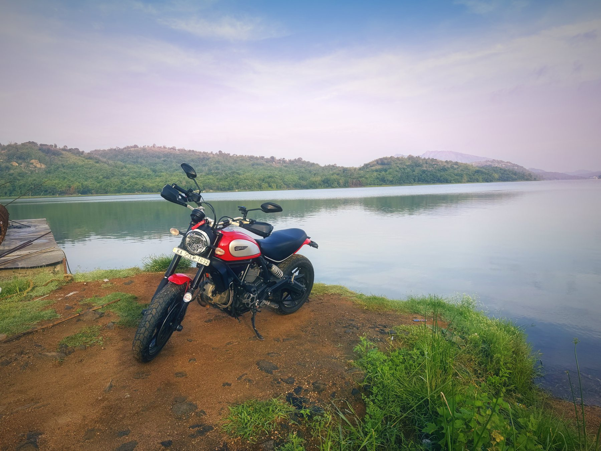
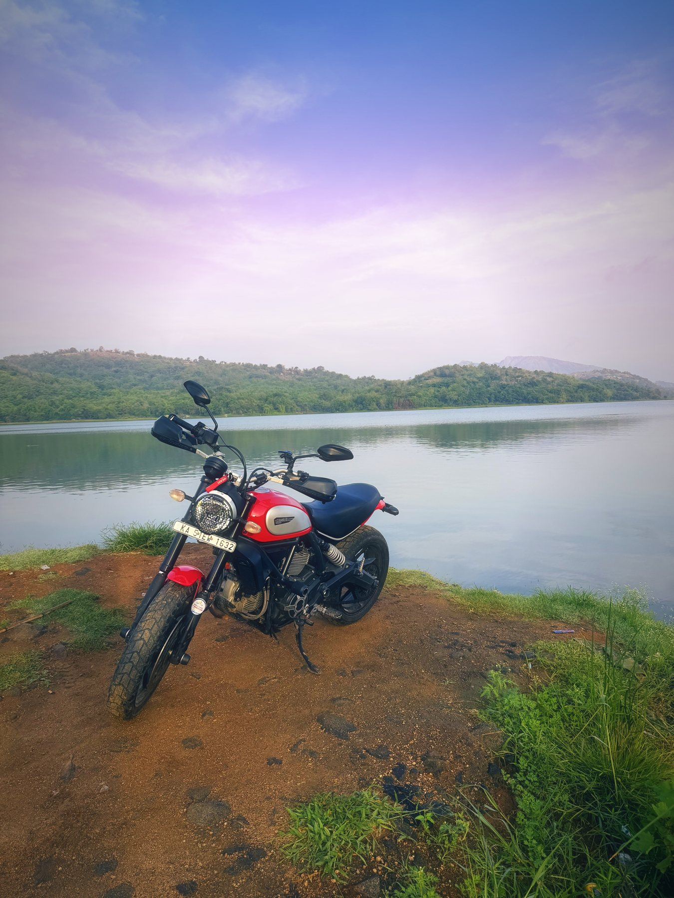
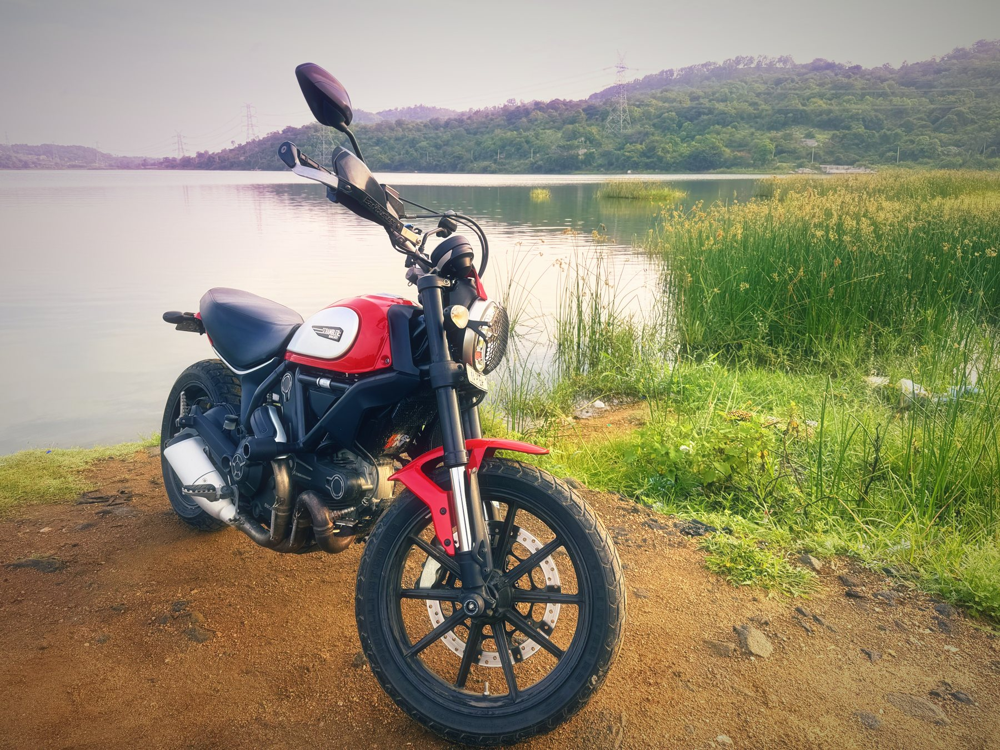
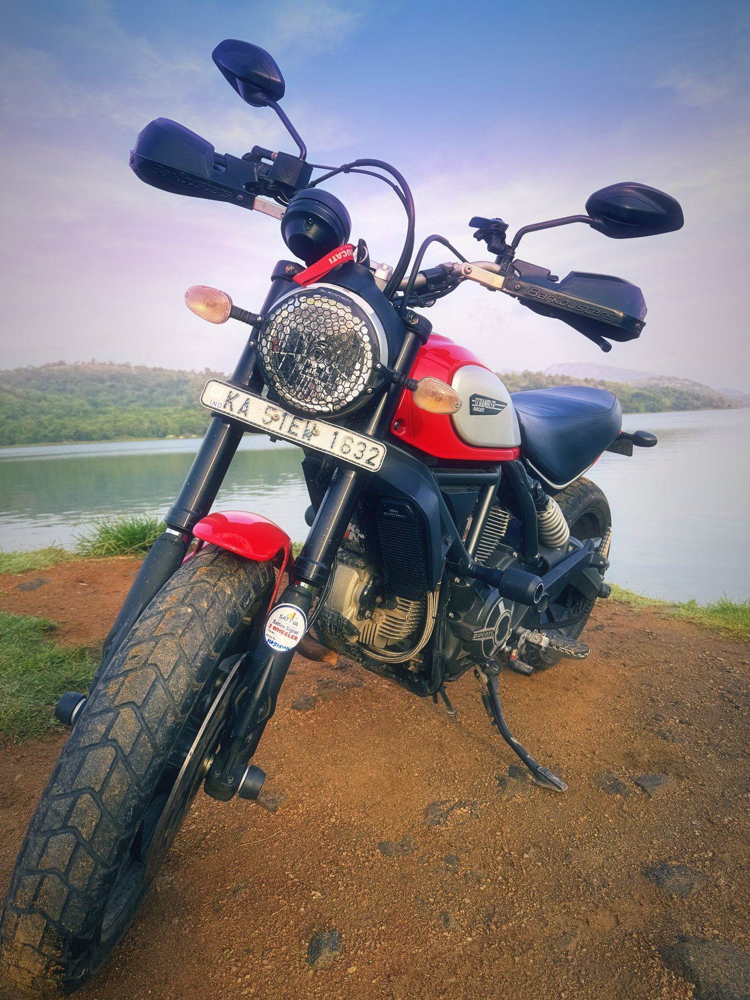

South India · India · Ridden 27 Sep 2026

<h1 class="rt-title">Manchanabele at 5 AM</h1>

Two Ducatis, one windscreen. A pre-dawn run from Bengaluru along Magadi Road to a still reservoir with Savandurga on the horizon.

dawn ridereservoirducatiscramblerdesert xshort ride

Each way<b>38 km</b>

Ride time<b>~1 hr</b>

Difficulty<b>Easy</b>

Best season<b>Oct – Mar</b>

Start<b>Bengaluru</b>

A short, early-morning out-and-back from Bengaluru to the Manchanabele reservoir on the Arkavathy, on a Scrambler with a Desert X for company. Empty city roads at five, fast open stretches on Magadi Road, winding village tarmac and a red-earth track down to the water.

<!-- Ride report for roadtrips/manchanabele-at-5am.json, rendered above the route sheet by scripts/build_roadtrips.py -->

The alarm went off at an hour that has no business existing. It was dark and quiet. The only other people awake were milk vans and a man sweeping a bus stop with total commitment.

By five, two Ducatis were idling at the end of my street. Mine was the red Scrambler. My companion's was a Desert X. Neither of us said much. We didn't need to. The bikes were doing all the talking.

## The city at five is a different city

Bengaluru at 5 AM is the city with all its bugs fixed. No traffic. No honking. No autos cutting across three lanes to stop exactly where you wanted to be. The signals blink amber at nobody. The streetlights hang orange in the mist and the tarmac is still cool from the night.

Riding through it feels like having production to yourself before the users log in. Everything is responsive. Every gap is yours.

We rolled out towards Magadi Road with the city thinning on both sides. First the flyovers, then the last of the apartment blocks, then the kind of open stretch where the horizon shows up for the first time. Somewhere past the edge of town, the sky started turning from black to navy to that washed-out blue that only exists for a few minutes each morning.

**If you've only ever ridden in Bengaluru after eight, you haven't ridden in Bengaluru.**

## Two L-twins, two voices

Both bikes are Ducati L-twins. They do not sound remotely alike.

The Scrambler is air-cooled and honest about it. At idle it has a loose, lumpy, slightly impatient beat, like it's tapping its foot. Open it up and it barks. It's raw and mechanical, with a hard edge on the overrun that pops and crackles when you roll off. It sounds like a machine that was built to be fun first and correct second.

The Desert X is the Testastretta. It's liquid-cooled, smoother and deeper, and more composed. Where the Scrambler barks, the Desert X growls. It has a heavier, fuller note that builds instead of snapping, and it pulls with the calm confidence of an engine that knows it has more in reserve than you'll ask for.

Riding together in the dark, with the Scrambler's rasp and the Desert X's bass bouncing off the empty shopfronts, was the best sound I've heard all year. **Same family, different builds. One sounds like a prototype, the other like a release.** I love them both for exactly that reason.

## Letting them breathe

Once the road opened up, we did what you do on an empty road at dawn with two twins and nobody around.

We let them run.

The Scrambler pulls hard and eagerly out of corners, and it loves the rush through the middle of the rev range. The Desert X just goes, with that unhurried shove that makes big adventure bikes feel faster than they look. We traded places a few times, the Desert X easing past on the long straights and the Scrambler clawing back through the bends, where it's lighter and more willing to change direction.

The air was cold enough to sting. The light was coming up grey and gold over the fields. There was mist sitting in the low ground on either side of the road. For a while there was nothing in my head except the next bend and the sound of two engines working.

**That's the whole point of leaving at five. The road is empty, so the ride is all yours.**

## The Scrambler's posture, and its one big flaw

The Scrambler sits you bolt upright, with wide, flat bars and your feet roughly underneath you. In the city it's perfect. You see over everything, you can flick it through gaps, and your wrists never complain. On broken village tarmac and the dirt at the end of the ride, it's even better. It's relaxed, controllable, and easy to stand up on the pegs over the rough bits.

Then you go fast, and you find out why the Desert X has a windscreen.

With no deflector, all of the wind lands on you. Your chest becomes a sail. The faster you go, the harder it tries to peel you off the back of the bike. So you start compensating without noticing. You grip the bars too tightly. You squeeze the tank with your knees. You tuck your elbows in and lean forward to cheat the air, in a posture the bike was never designed for.

Then the side effects show up:

- **Neck and shoulders.** Your helmet turns into a small parachute. Holding your head still against that pull is a workout nobody asked for, and you feel it the next morning.
- **Buffeting.** The air hitting your chest and helmet isn't smooth. It shakes the helmet, gets noisy, and makes it harder to hear either engine, which is the one thing I actually came for.
- **Cold.** At 5 AM, a naked bike delivers the full morning chill straight through the jacket. There's no bubble of still air to hide in.
- **Bugs.** Dawn is rush hour for insects. The Scrambler's rider collects all of them personally.

Meanwhile my companion sat behind the Desert X's rally screen, upright and relaxed, looking like a man having a nice cup of tea. It was very annoying.

**A windscreen isn't about speed. It's about how long you can enjoy the speed.** Even a small flyscreen would take a lot of pressure off the chest and helmet. It's the next thing going on this bike.

## And then the reservoir

The last stretch into Manchanabele is narrow, winding village road that finally gives up and turns to red earth. The Scrambler felt completely at home there. The Desert X, predictably, felt like it had been waiting all morning for this bit.

We killed the engines and the silence landed all at once.

The reservoir was flat calm, a mirror of the sky. Green hills wrapped around the water, and far off on the horizon was the hump of Savandurga, grey against the morning haze. Reeds along the edge. A little mist still clinging to the far shore. The only sound was the engines ticking as they cooled.

It isn't a postcard. There are power lines marching across the hills, and the shore has its share of rubbish. But in that light, with the bikes steaming gently on the mud, none of it mattered.

One serious note. The water looks calm, but it's dangerous. The reservoir bed is full of sudden drop-offs, boulders and deep slush, and far too many people have drowned here. Swimming is prohibited for good reason. Admire it from the shore.

## Mud on the tyres, grin on the face

We spent a while just standing there. Photos, a bit of chat, a lot of staring at the water. The Scrambler got its obligatory hero shots, with mud on the tyres, the Barkbusters, and the red tank glowing against the green.

Then we fired them up again, and the two exhausts cracked across the water, one bark, one growl, and we rode home as the city woke up and took its roads back.

If you're in Bengaluru and you own a bike:

- **Leave at five.** Not six. Five. The empty roads and the light are worth every lost minute of sleep.
- **Ride with a friend.** Ideally one whose bike sounds different from yours.
- **Layer up.** It's colder at dawn than you think, especially on a naked bike.
- **Get a flyscreen** if your bike doesn't have one. Your neck will thank you.
- **Stay out of the water.** Really.

The Scrambler has no windscreen and a lot of attitude. On a morning like this, that turns out to be the right way round.

## The route

Schematic map generated from waypoint coordinates — the shape follows the geography (compressed so long legs don't squash the loop), distances are labelled per leg. Not a navigation map. <a href="manchanabele-at-5am-route.svg" download>Download the graphic</a>.

<h3>Leg by leg</h3>

<table class="rt-segs"><thead><tr><th>#</th><th>Leg</th><th>Dist</th><th>Notes</th></tr></thead><tbody><tr><td>1</td><td><b>Bengaluru → Tavarekere</b>
Magadi Road
</td><td class="rt-km">22 km</td><td>Empty at five. Flyovers, then the city thins out and the road opens up for the fast bits. tarmac</td></tr><tr><td>2</td><td><b>Tavarekere → Manchanabele</b>
Village roads to the reservoir
</td><td class="rt-km">16 km</td><td>Narrow, winding tarmac through villages, ending in a red-earth track down to the water. mixed</td></tr></tbody></table>

<h3>Highlights</h3><ul><li>Bengaluru at 5 AM with the roads to yourself</li><li>The open stretches of Magadi Road at first light</li><li>A flat-calm reservoir with Savandurga on the horizon</li><li>Mist on the far shore and reeds along the water&#x27;s edge</li></ul>

<h3>Off-road &amp; motorcycling notes</h3>
<i class="on"></i><i class=""></i><i class=""></i><i class=""></i><i class=""></i>

Tarmac all the way except the last red-earth track to the shore.
<ul><li>The last stretch is packed earth with ruts and loose gravel, easy on any road bike ridden gently</li><li>Turns to paste when wet; park on firm ground, not the grassy edge</li><li>Road-biased dual-sport tyres (the Scrambler&#x27;s Pirelli MT60 RS) are plenty</li></ul>

<h3>Timings, permits &amp; fuel</h3><ul><li>Leave around 5 AM for empty roads and dawn light at the water</li><li>The dam area is listed as open 6 AM – 6 PM, entry free</li><li>Fuel up in the city; there&#x27;s nothing you need to rely on near the reservoir</li></ul>

<h3>Cautions</h3><ul><li>Do not enter the water: the reservoir bed has sudden drop-offs, boulders and deep slush, and many people have drowned here</li><li>Dawn is cold on a naked bike; layer up</li><li>Village stretch has livestock, speed breakers and early-morning foot traffic</li><li>No windscreen means wind blast on the fast sections; expect neck and shoulder fatigue</li></ul>

## Sources &amp; further reading

<ul class="rt-sources"><li><a href="https://en.wikipedia.org/wiki/Manchanabele" rel="noopener">Manchanabele — Wikipedia</a></li><li><a href="https://en.wikipedia.org/wiki/Savandurga" rel="noopener">Savandurga — Wikipedia</a></li><li><a href="https://www.trawell.in/karnataka/bangalore/manchanabele-dam" rel="noopener">Manchanabele Dam — Trawell.in</a></li></ul>

<a href="../">← All road trips</a>

