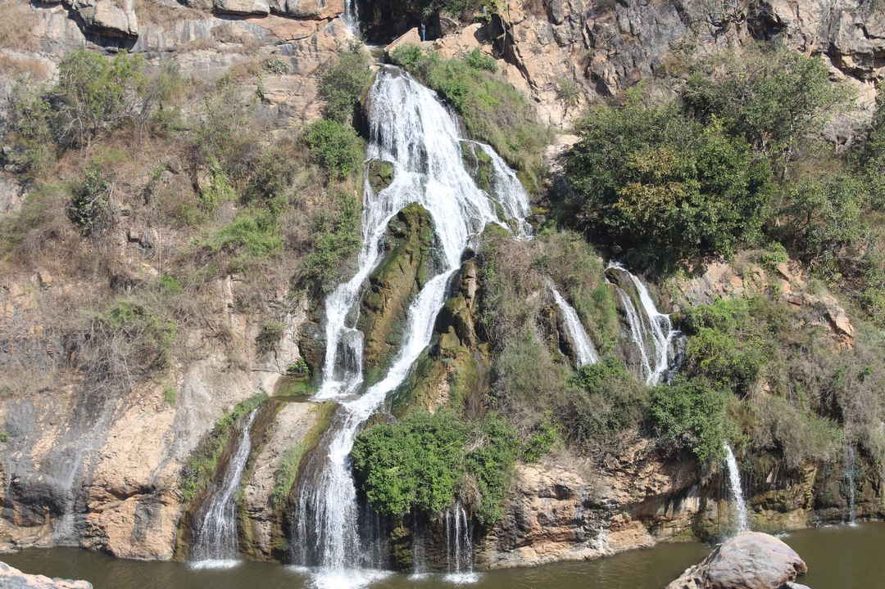
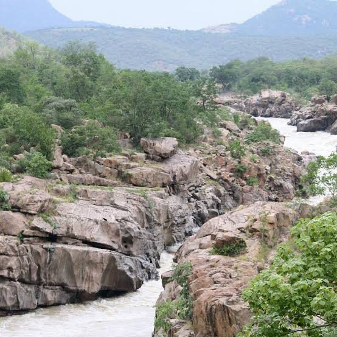

South India · India · Ridden Aug 2026

<h1 class="rt-title">Mekedatu &amp; Dabbaguli ADV Circuit</h1>

Bengaluru → Bidadi thatte idli → Kanakapura → Chunchi Falls → Sangama (Kaveri–Arkavathy confluence) → a dirt trail to the Dabbaguli riverside on the Tamil Nadu border → home via Anekal. A one-day ADV loop, skipping the highways.

advsolodirt trailriverforestday ride

Distance<b>290 km</b>

Ride time<b>9–11 hrs</b>

Difficulty<b>Moderate</b>

Best season<b>Oct – Feb</b>

Start<b>Bengaluru</b>

A one-day adventure loop around south-west Bengaluru that skips the highways for backroads and forest. Breakfast at Bidadi, down the Kanakapura road to Chunchi Falls and the Sangama confluence and the Mekedatu gorge, then east through Kodihalli to a rocky, muddy trail into the Cauvery forest that ends at the raw riverbank at Dabbaguli. The return swings east along the Tamil Nadu border and comes back into the city via Anekal.

Route idea: <a href="https://www.instagram.com/roadhawk.vlogs/" rel="noopener">@roadhawk.vlogs</a>

<!-- Ride report for roadtrips/mekedatu-dabbaguli-adv-circuit.json, rendered above the route sheet by scripts/build_roadtrips.py -->

Some rides are a list of stops with riding in between. This one is the other way round.

On paper it's a checklist: breakfast at Bidadi, Chunchi Falls, the confluence at Sangama, a dirt trail, a riverbank in Tamil Nadu, home. All true. But what stayed with me afterwards wasn't any single stop. It was that the ride **never let up**. From the moment I left the city to the moment I rolled back in, there wasn't a single boring stretch.

Just me and the Scrambler, all day.

## One long, unbroken flow

Most day rides out of Bengaluru have a dead zone. You grind out an hour of highway to earn the good bit, then grind the same hour back. This loop doesn't have one.

Mysore Road gets you out of the city and done with traffic quickly. Then the route peels off onto the backroads through Harohalli, and the character changes. The roads narrow, the villages close in, and the traffic thins to tractors, buses and the odd goat with opinions.

Kanakapura Road opens up for a fast, flowing stretch. Then the descent towards Sangama starts to wind through scrub and rock, and the bike finally has something to do. Each section hands over to the next before the last one gets old.

**It's the riding equivalent of a well-paced system: no idle time, no blocking calls, just one stage feeding the next.**

Past Kanakapura I took the short detour to Chunchi Falls, where the water spills down a rock face in dozens of thin streams into a pool at the bottom. Then it's back on the bike and down to Sangama, where the Arkavathy meets the Kaveri, and on to Mekedatu, where the river squeezes through a gorge of pink-grey rock.

## Solo changes the ride

Riding alone, there's no one to wait for at junctions, no group chat about the next stop, and no negotiation over breakfast. You ride your own pace and stop when you feel like it. On this loop I mostly didn't feel like it.

It also means everything is on you. Nobody's behind you if the bike goes down on the trail, and phone signal is patchy in the forest. That makes you ride the dirt with a bit more respect than you would in a group.

## Where the tarmac gives up

After Sangama, the loop cuts east through Kodihalli, and the village roads get smaller and rougher until they stop pretending to be roads at all.

Then it's the trail: rock, ruts, loose stones and patches of mud, winding through the forest towards the river. This is what the Scrambler is actually for. You stand on the pegs, loosen your grip, and let the bike move under you. The wide bars make it easy to steer with your weight, and the tyres find grip where you wouldn't expect it.

It's also where the armour earns its keep. Stones pinging off the sump guard is a very reassuring sound when you're alone in a forest and the nearest mechanic is a long way away.

The trail is slow, noisy and completely absorbing. You don't think about anything except the next line through the rocks.

## The river at the end of it

The trail ends at Dabbaguli, on the banks of the Kaveri. The river is wide, and the bank is raw and undeveloped. No railings, no stalls, no crowd. The engine ticks as it cools, and for a few minutes that's the only sound.

It's beautiful, and it's also a reminder of where you are. There are crocodiles in this river. You look, you don't wade.

Then it's back up the same trail, which rides completely differently in the other direction, and out onto the backroads along the Tamil Nadu border. The loop swings north through the villages and comes back into the city via Anekal, dusty, tired and grinning.

## If you're riding it

- **Start early.** It's a long day, and you want to be out of the forest well before dark.
- **Fuel up at Kanakapura.** There's nothing to rely on for a long way after that.
- **Solo is fine, but be self-sufficient.** Carry water, a puncture kit and a tow strap, and tell someone your route.
- **Stand up on the trail.** Loose rock is easier on the pegs than sitting down.
- **Respect the water.** Slippery rocks at Sangama and Mekedatu, crocodiles at Dabbaguli.

I went for the stops. I came back remembering the riding between them, and there was never a moment of it I'd skip.

## The route

Schematic map generated from waypoint coordinates — the shape follows the geography (compressed so long legs don't squash the loop), distances are labelled per leg. Not a navigation map. <a href="mekedatu-dabbaguli-adv-circuit-route.svg" download>Download the graphic</a>.

<h3>Leg by leg</h3>

<table class="rt-segs"><thead><tr><th>#</th><th>Leg</th><th>Dist</th><th>Notes</th></tr></thead><tbody><tr><td>1</td><td><b>Bengaluru → Bidadi</b>
Mysore Road (NH 275)
</td><td class="rt-km">35 km</td><td>Out of the city early; stop at Bidadi for thatte idli. tarmac</td></tr><tr><td>2</td><td><b>Bidadi → Harohalli</b>
Bidadi – Harohalli backroad
</td><td class="rt-km">25 km</td><td>Quiet cross-country road that skips the highway. tarmac</td></tr><tr><td>3</td><td><b>Harohalli → Kanakapura</b>
Kanakapura Road (NH 948)
</td><td class="rt-km">20 km</td><td>Fast, wide stretch into Kanakapura. Last reliable fuel for a while. tarmac</td></tr><tr><td>4</td><td><b>Kanakapura → Chunchi Falls</b>
Kanakapura – Sangama road
</td><td class="rt-km">25 km</td><td>Winding road south through scrub and hills. Detour to Chunchi Falls on the way. tarmac</td></tr><tr><td>5</td><td><b>Chunchi Falls → Sangama</b>
Chunchi Falls → Sangama
</td><td class="rt-km">14 km</td><td>Short, twisty run down to the confluence. tarmac</td></tr><tr><td>6</td><td><b>Sangama → Kodihalli</b>
Back north, then east via village roads
</td><td class="rt-km">25 km</td><td>Retrace towards Kanakapura, then cut east to Kodihalli. tarmac</td></tr><tr><td>7</td><td><b>Kodihalli → Dabbaguli</b>
Kodihalli → forest trail
</td><td class="rt-km">35 km</td><td>Village roads, then about 10 km of rocky, muddy dirt trail down to the river. The same trail brings you back out. dirt</td></tr><tr><td>8</td><td><b>Dabbaguli → Anekal</b>
Border villages → Anekal
</td><td class="rt-km">75 km</td><td>Back up the trail, then backroads along the Karnataka–Tamil Nadu border to Anekal. mixed</td></tr><tr><td>9</td><td><b>Anekal → Bengaluru</b>
Anekal – Hosur Road
</td><td class="rt-km">37 km</td><td>Back into the city from the south-east. tarmac</td></tr></tbody></table>

<h3>Highlights</h3><ul><li>Thatte idli at Bidadi for breakfast</li><li>Chunchi Falls, spilling down a rock face in dozens of streams</li><li>Sangama, where the Arkavathy joins the Kaveri, and the Mekedatu gorge downstream</li><li>About 20 km of dirt trail (in and out) through the Cauvery forest</li><li>The raw, undeveloped riverbank at Dabbaguli</li><li>Whole loop avoids the big highways once you&#x27;re past Bidadi</li></ul>

<h3>Off-road &amp; motorcycling notes</h3>
<i class="on"></i><i class="on"></i><i class="on"></i><i class=""></i><i class=""></i>

Mostly tarmac, with a proper dirt section: about 10 km each way of rocky, muddy trail to Dabbaguli.
<ul><li>Loose rock and ruts on the forest trail; stand on the pegs and keep momentum</li><li>Turns to mud after rain; road-biased tyres will struggle in the wet</li><li>Ride it with at least one other bike; there&#x27;s little phone signal or help on the trail</li><li>Adventure bikes and scramblers are ideal; skip it on a low-slung road bike</li></ul>

<h3>Timings, permits &amp; fuel</h3><ul><li>Dabbaguli: listed open 8 AM – 5 PM, two-wheeler entry about ₹30</li><li>Sangama: public buses to Mekedatu stop by about 5:30 PM</li><li>Fuel up at Kanakapura; nothing reliable between there and Anekal</li><li>Plan to be out of the forest well before dark</li></ul>

<h3>Cautions</h3><ul><li>Do not enter the river at Dabbaguli: it has wild crocodiles</li><li>Rocks at Sangama and Mekedatu are steep and slippery, and currents are dangerous, especially after the monsoon</li><li>Wildlife sanctuary area: watch for elephants and other animals on the trail</li><li>Carry water, a puncture kit and a tow strap; the trail is remote</li></ul>

## Sources &amp; further reading

<ul class="rt-sources"><li><a href="https://www.triphippies.com/dabbaguli/" rel="noopener">Dabbaguli: Off-Road Getaway Near Bangalore — TripHippies</a></li><li><a href="https://www.trawell.in/karnataka/bangalore/sangama-mekedatu" rel="noopener">Sangama &amp; Mekedatu — Trawell.in</a></li><li><a href="https://en.wikipedia.org/wiki/Chunchi_Falls" rel="noopener">Chunchi Falls — Wikipedia</a></li><li><a href="https://en.wikipedia.org/wiki/Kodihalli,_Kanakapura" rel="noopener">Kodihalli, Kanakapura — Wikipedia</a></li><li><a href="https://www.tripadvisor.com/Restaurant_Review-g7909305-d8857226-Reviews-Shri_Renuukamba_Thatte_Idli-Bidadi_Ramanagara_District_Karnataka.html" rel="noopener">Shri Renuukamba Thatte Idli, Bidadi — Tripadvisor</a></li></ul>

<a href="../">← All road trips</a>

