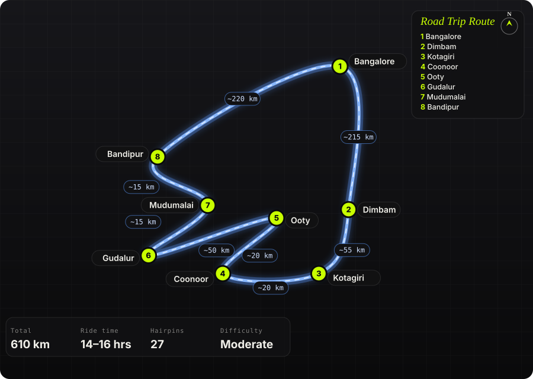

South India · India · 1–2 days

<h1 class="rt-title">The Nilgiri Loop</h1>

Bangalore → Dimbam ghat → Kotagiri → Coonoor → Ooty → Gudalur → Mudumalai → Bandipur → Bangalore. 610 km, two tiger reserves and a 27-hairpin climb.

tea estateshairpinstiger reservesghat roadsloopmotorcycle

Distance<b>610 km</b>

Ride time<b>14–16 hrs</b>

Hairpins<b>27</b>

Difficulty<b>Moderate</b>

Best season<b>Oct – Mar</b>

Start<b>Bangalore</b>

A clockwise loop out of Bangalore that climbs into the Nilgiris the hard way — up the Dimbam ghat from the Sathyamangalam forests — rides the tea-estate ridge from Kotagiri to Ooty, drops through Gudalur, and comes home along the Mudumalai–Bandipur elephant corridor. Doable as a very long single day (14–16 hours of riding) but far better as two days with a night in Coonoor or Ooty.

Route idea: @odesseyofduo_4.9.25 &amp; @sheidu_khan on Instagram — the &#x27;Nilgiri Loop&#x27; reel that started this entry — 610 km, 27 hairpins (yes, they counted)

## The route

Schematic map generated from waypoint coordinates — the shape follows the geography (compressed so long legs don't squash the loop), distances are labelled per leg. Not a navigation map. <a href="nilgiri-loop-route.svg" download>Download the graphic</a>.

<h3>Leg by leg</h3>

<table class="rt-segs"><thead><tr><th>#</th><th>Leg</th><th>Dist</th><th>Notes</th></tr></thead><tbody><tr><td>1</td><td><b>Bangalore → Dimbam</b>
NH 948 via Kanakapura → Malavalli → Kollegal → Chamarajanagar → Sathyamangalam road
</td><td class="rt-km">215 km</td><td>Fast, mostly two-lane. Fuel up at Chamarajanagar. The last 30 km before Dimbam run through Sathyamangalam Tiger Reserve. tarmac</td></tr><tr><td>2</td><td><b>Dimbam → Kotagiri</b>
Dimbam ghat → Thalavadi → Kotagiri road
</td><td class="rt-km">55 km</td><td>The 27 hairpins are on the Dimbam climb. Narrow, blind corners, buses cutting the apex. Then rolling plateau to Kotagiri. 27 hairpins tarmac</td></tr><tr><td>3</td><td><b>Kotagiri → Coonoor</b>
Kotagiri – Coonoor road
</td><td class="rt-km">20 km</td><td>Tea estates both sides; stop at the Kotagiri view points. Foggy after noon. tarmac</td></tr><tr><td>4</td><td><b>Coonoor → Ooty</b>
Coonoor – Ooty (NH 181 ghat)
</td><td class="rt-km">20 km</td><td>Runs beside the Nilgiri Mountain Railway. Heavy tourist traffic on weekends. tarmac</td></tr><tr><td>5</td><td><b>Ooty → Gudalur</b>
Ooty – Naduvattam – Gudalur (NH 181)
</td><td class="rt-km">50 km</td><td>Long descent, some broken patches after monsoon. Pykara falls and Naduvattam viewpoint en route. mixed</td></tr><tr><td>6</td><td><b>Gudalur → Mudumalai</b>
Gudalur – Theppakadu (NH 181)
</td><td class="rt-km">15 km</td><td>Enter Mudumalai Tiger Reserve. 40 km/h, no stopping, no horn. tarmac</td></tr><tr><td>7</td><td><b>Mudumalai → Bandipur</b>
Theppakadu – Bandipur check post (NH 181 / NH 766)
</td><td class="rt-km">15 km</td><td>Elephant corridor; the most likely stretch for an elephant on the road. tarmac</td></tr><tr><td>8</td><td><b>Bandipur → Bangalore</b>
Bandipur → Gundlupet → Mysore ring road → NH 275 Bangalore
</td><td class="rt-km">220 km</td><td>Clear Bandipur before the two-wheeler cut-off. The Mysore–Bangalore expressway is fast and dull. tarmac</td></tr></tbody></table>

<h3>Highlights</h3><ul><li>The Dimbam climb — 27 numbered hairpins rising out of the Sathyamangalam forest with the plains behind you.</li><li>Kotagiri to Coonoor ridge road through tea estates; Kodanad and Catherine Falls viewpoints are short detours.</li><li>Coonoor–Ooty alongside the toy train line; Lamb&#x27;s Rock and Dolphin&#x27;s Nose near Coonoor.</li><li>Pykara Falls and the Naduvattam viewpoint on the Ooty–Gudalur descent.</li><li>Mudumalai and Bandipur — riding through two tiger reserves back-to-back, elephants and gaur likely at dusk.</li></ul>

<h3>Off-road &amp; motorcycling notes</h3>
<i class="on"></i><i class="on"></i><i class=""></i><i class=""></i><i class=""></i>

This is a tarmac loop — the challenge is the ghat sections, not dirt. Any road bike handles it; an ADV or scrambler just makes the broken patches easier.
<ul><li>Dimbam ghat: tight hairpins with loose gravel on the inside line after rain. Keep to your lane — buses use the whole road.</li><li>Ooty–Gudalur descent has potholed stretches and washed-out edges after the monsoon (Jun–Sep). Ride in the tyre tracks.</li><li>Optional dirt detour: the Masinagudi–Ooty &#x27;Kalhatti ghat&#x27; (36 hairpins, very steep, one lane) instead of Gudalur — only in dry weather and only if you&#x27;re confident with steep low-speed hairpins.</li><li>Fog and wet roads in Coonoor/Ooty from mid-afternoon; moss on the shaded corners is slippery.</li><li>Luggage: soft panniers or a tail bag; hard cases make the hairpin lane-share with buses tighter than you&#x27;d like.</li></ul>

<h3>Timings, permits &amp; fuel</h3><ul><li>Bandipur &amp; Mudumalai forest stretch is CLOSED to all traffic 9:00 PM – 6:00 AM every day (Karnataka HC order). Two-wheelers are restricted earlier on the Bandipur side, roughly from 6:00 PM — plan to clear Bandipur by late afternoon.</li><li>Sathyamangalam forest (before Dimbam) has check posts; night riding is discouraged and elephants cross the road.</li><li>No permits needed. Carry ID; forest check posts may ask.</li><li>Fuel: Chamarajanagar and Sathyamangalam before the climb; Kotagiri, Coonoor, Ooty, Gudalur on the plateau; Gundlupet after Bandipur. Nothing inside the reserves.</li></ul>

<h3>Cautions</h3><ul><li>Wild elephants on the road in Sathyamangalam, Mudumalai and Bandipur — stop, kill the engine, give way, never overtake a herd.</li><li>Ooty–Coonoor weekend traffic can add an hour; start the loop before 5 AM if attempting it in one day.</li><li>Cold: Ooty drops to single digits in Dec–Jan mornings. Layers and a neck gaiter.</li><li>The 14–16 hour figure is riding time only. Two riders in the source reel did it; most people should split it.</li></ul>

## Along the way

<figure><figcaption>Glenmorgan tea estate near Ooty <a href="https://commons.wikimedia.org/wiki/File:Glenmorgan_Tea_estate%2C_Ooty.jpg" rel="noopener">Wikimedia Commons · free licence, see file page</a></figcaption></figure><figure><figcaption>Dimbam ghat hairpins on the old NH 209 (now NH 948) <a href="https://commons.wikimedia.org/wiki/File:NH-209-Dimbam_Ghat.jpg" rel="noopener">Wikimedia Commons · free licence, see file page</a></figcaption></figure><figure><figcaption>View point on the Kotagiri–Ooty road <a href="https://commons.wikimedia.org/wiki/File:Mettupalayam_view_point_in_Kotagiri_-_Ooty_Road_IMG_20180827_175744990.jpg" rel="noopener">Wikimedia Commons · free licence, see file page</a></figcaption></figure><figure><figcaption>Singara tea estate, Coonoor <a href="https://commons.wikimedia.org/wiki/File:Singara_Tea_Estate%2C_Coonoor.jpg" rel="noopener">Wikimedia Commons · free licence, see file page</a></figcaption></figure><figure><figcaption>Nilgiri Mountain Railway at Hillgrove <a href="https://commons.wikimedia.org/wiki/File:Nilgiri_Mountain_Railway-NMR_X_37396_%28Neela_Kurinji%29-Hillgrove_Railway_Station-WUS05787.jpg" rel="noopener">Wikimedia Commons · free licence, see file page</a></figcaption></figure><figure><figcaption>Tea plantations on the Gudalur–Ooty road <a href="https://commons.wikimedia.org/wiki/File:Tea_Plantation_%40_Gudalur_-_ooty_Road_-_panoramio_%283%29.jpg" rel="noopener">Wikimedia Commons · free licence, see file page</a></figcaption></figure><figure><figcaption>The Nilgiris from Bokkapuram, Mudumalai elephant corridor <a href="https://commons.wikimedia.org/wiki/File:Niligiris_seen_from_Bokkapuram%2CMudumalai%2CElephant_corridor%2CWestern_Ghats.jpg" rel="noopener">Wikimedia Commons · free licence, see file page</a></figcaption></figure><figure><figcaption>Spotted deer beside the road, Bandipur <a href="https://commons.wikimedia.org/wiki/File:Deers_in_Bandipur_Forest%2C_Karnataka%2C_India.jpg" rel="noopener">Wikimedia Commons · free licence, see file page</a></figcaption></figure>

## Sources &amp; further reading

<ul class="rt-sources"><li><a href="https://ootymade.com/pages/ooty-mysore-road-bandipur-mudumalai-timings-night-ban" rel="noopener">Ooty–Mysore road: Bandipur &amp; Mudumalai timings and night ban (OotyMade)</a></li><li><a href="https://www.thenewsminute.com/karnataka/explained-why-environmentalists-don-t-want-vehicles-enter-bandipur-forest-night-110107" rel="noopener">Why environmentalists don&#x27;t want night traffic in Bandipur (The News Minute)</a></li></ul>

<a href="../">← All road trips</a>

