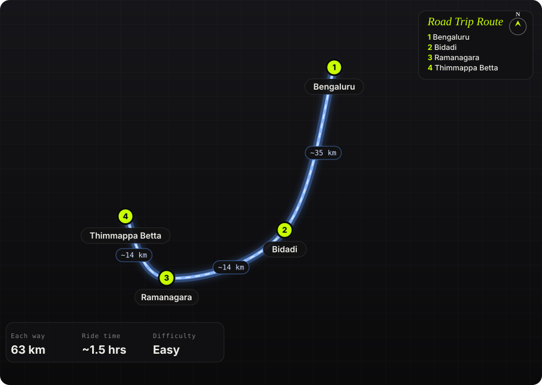

South India · India · Half day

<h1 class="rt-title">Thimmappa Betta</h1>

Bengaluru → Bidadi → Ramanagara → Kutgal → Thimmappa Betta. ~63 km, ride up onto sheet rock beneath giant twin boulders.

breakfast ridesunrisetwin rockssheet rockramanagara

Each way<b>63 km</b>

Ride time<b>~1.5 hrs</b>

Difficulty<b>Easy</b>

Best season<b>Nov – Feb</b>

Start<b>Bengaluru</b>

Thimmappana Betta, also called Kootagal or Thimmappa Swamy Betta, is a granite hill near Kutgal village, about 10 km from Ramanagara. A good road runs to the Thimmappa Swamy temple at its base, and from there bikes can climb onto the bare sheet rock towards the hill&#x27;s two giant standing boulders. It is a quiet alternative to Nandi Hills for a sunrise breakfast ride.

Route idea: @twoofusonwheels on Instagram

## The route

Schematic map generated from waypoint coordinates — the shape follows the geography (compressed so long legs don't squash the loop), distances are labelled per leg. Not a navigation map. <a href="thimmappa-betta-route.svg" download>Download the graphic</a>.

<h3>Leg by leg</h3>

<table class="rt-segs"><thead><tr><th>#</th><th>Leg</th><th>Dist</th><th>Notes</th></tr></thead><tbody><tr><td>1</td><td><b>Bengaluru → Bidadi</b>
NH275 (Bengaluru–Mysuru road)
</td><td class="rt-km">35 km</td><td>Fast run out of the city on the expressway or its service road. tarmac</td></tr><tr><td>2</td><td><b>Bidadi → Ramanagara</b>
NH275
</td><td class="rt-km">14 km</td><td>Past Bidadi to the Ramanagara traffic signal; turn right. tarmac</td></tr><tr><td>3</td><td><b>Ramanagara → Thimmappa Betta</b>
Village roads via Kutgal
</td><td class="rt-km">14 km</td><td>Through one or two villages with a few potholes to the temple at the base, then a short climb onto the rock. mixed</td></tr></tbody></table>

<h3>Highlights</h3><ul><li>Two huge standing boulders above the parking rock</li><li>Riding onto open sheet rock, rare this close to Bengaluru</li><li>Thimmappa Swamy temple at the base</li><li>Two viewpoints, one by the temple and one ~15 min walk away</li></ul>

<h3>Off-road &amp; motorcycling notes</h3>
<i class="on"></i><i class="on"></i><i class=""></i><i class=""></i><i class=""></i>

Tarmac to the base, then a short climb on bare granite that most bikes manage in the dry.
<ul><li>A rider reports a Royal Enfield Himalayan climbing it easily, hopping one small water pipe</li><li>The final stretch to the rocks is on foot</li><li>Granite gets slippery when wet; heavy or low-powered bikes need care</li></ul>

<h3>Timings, permits &amp; fuel</h3><ul><li>Open 6 AM – 5 PM</li><li>Entry ~₹20 per motorcycle, ~₹50 per car</li><li>Arrive before sunrise for the best light</li></ul>

<h3>Cautions</h3><ul><li>Avoid riding on the rock in the rain</li><li>No facilities on the hill; carry water, eat on Mysuru road</li><li>Steep rock faces around the boulders</li><li>No alcohol allowed; go in a group rather than solo</li></ul>

## Sources &amp; further reading

<ul class="rt-sources"><li><a href="https://www.enidhi.net/2017/09/thimmappana-betta-twin-rocks-ramanagara.html" rel="noopener">Thimmappana Betta Twin Rocks, Ramanagara – eNidhi India Travel Blog</a></li><li><a href="https://www.xbhp.com/talkies/tourer/37583-a-very-short-ride-to-thimmappa-swamy-betta-from-bangalore" rel="noopener">A very short ride to Thimmappa Swamy Betta from Bangalore – xBhp</a></li><li><a href="https://www.trawell.in/karnataka/bangalore/thimmappana-betta" rel="noopener">Thimmappana Betta, Bangalore – Trawell.in</a></li><li><a href="https://praveenmusafir.com/karnataka/bangalore/thimappana-betta/" rel="noopener">Thimappana Betta – Praveen Musafir</a></li><li><a href="https://www.tripoto.com/trip/thimmappana-betta-breakfast-getaways-weekend-rides-5ae0d1e84f24b" rel="noopener">Thimmappana Betta – Tripoto</a></li></ul>

<a href="../">← All road trips</a>

