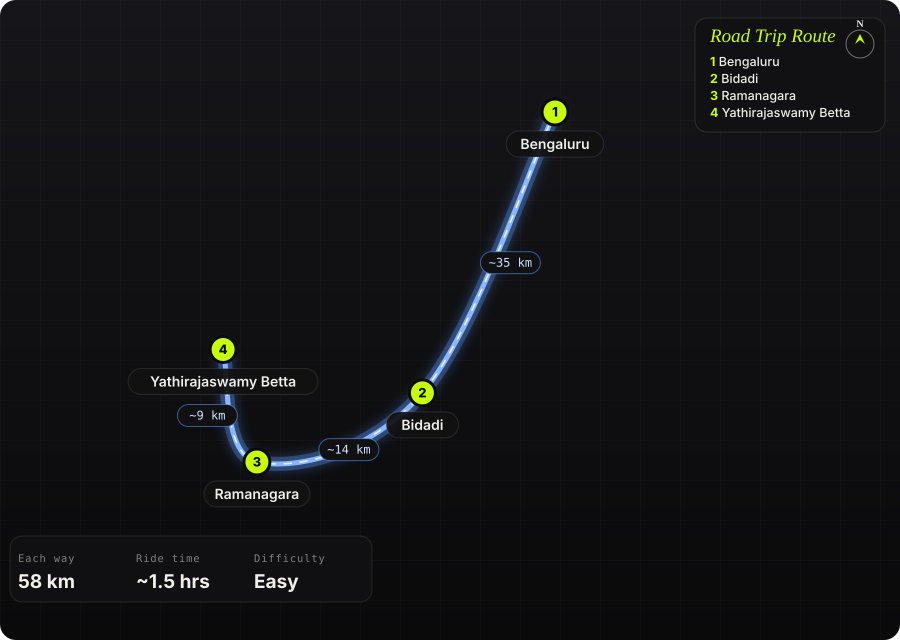

South India · India · Half day

<h1 class="rt-title">Yathirajaswamy Betta</h1>

Bengaluru → Bidadi → Ramanagara → Yathirajaswamy Betta. ~58 km, a bare granite hillock with a cave shrine and old fort remains.

breakfast rideshort hikegranitecave templeramanagara

Each way<b>58 km</b>

Ride time<b>~1.5 hrs</b>

Difficulty<b>Easy</b>

Best season<b>Oct – Feb</b>

Start<b>Bengaluru</b>

Yathirajaswamy Betta, also called Kote Betta, is a bare granite hillock near Thimmasandra village, about 8 km north of Ramanagara off the Ramanagara–Magadi road. Bikes are parked in a mango orchard at the base, and rock-cut steps lead up in about 20–30 minutes to a small cave temple of Yathiraja (Ramanujacharya) beside a perennial spring, with traces of an old fort on top. From the summit you get a 360-degree view over Ramanagara&#x27;s boulder hills.

Route idea: @twoofusonwheels on Instagram

## The route

Schematic map generated from waypoint coordinates — the shape follows the geography (compressed so long legs don't squash the loop), distances are labelled per leg. Not a navigation map. <a href="yathirajaswami-betta-route.svg" download>Download the graphic</a>.

<h3>Leg by leg</h3>

<table class="rt-segs"><thead><tr><th>#</th><th>Leg</th><th>Dist</th><th>Notes</th></tr></thead><tbody><tr><td>1</td><td><b>Bengaluru → Bidadi</b>
NH275 (Bengaluru–Mysuru road)
</td><td class="rt-km">35 km</td><td>Fast run out of the city on the expressway or its service road. tarmac</td></tr><tr><td>2</td><td><b>Bidadi → Ramanagara</b>
NH275
</td><td class="rt-km">14 km</td><td>Past Bidadi to the Ramanagara traffic signal; turn right towards Magadi. tarmac</td></tr><tr><td>3</td><td><b>Ramanagara → Yathirajaswamy Betta</b>
Ramanagara–Magadi road, then village road
</td><td class="rt-km">9 km</td><td>~8 km towards Magadi, left towards Koonumuddanahalli, hill on the right after ~1 km. tarmac</td></tr></tbody></table>

<h3>Highlights</h3><ul><li>Short climb on rock-cut steps to a whitewashed cave shrine</li><li>Perennial spring beside the temple</li><li>Remains of an old fort on the summit</li><li>360-degree views over Ramanagara&#x27;s granite hills</li></ul>

<h3>Off-road &amp; motorcycling notes</h3>
<i class=""></i><i class=""></i><i class=""></i><i class=""></i><i class=""></i>

Paved all the way; the hill itself is climbed on foot, not ridden.
<ul><li>Bikes park at the base in a mango orchard</li><li>A Google Maps interior route via Dharapura skips Ramanagara town on village roads</li></ul>

<h3>Timings, permits &amp; fuel</h3><ul><li>Open all day; no entry hours</li><li>~20–30 min climb up, about an hour in total on the hill</li><li>Early morning is best, before the rock heats up</li></ul>

<h3>Cautions</h3><ul><li>Steep, near-vertical faces near the summit; stay on the steps</li><li>Temple is often locked with no priest present</li><li>No shops at the base; carry water</li><li>Litter from picnics around the base; carry yours back</li></ul>

## Sources &amp; further reading

<ul class="rt-sources"><li><a href="https://www.teamgsquare.com/2016/05/shri-yathiraja-swamy-betta-ramanagar.html" rel="noopener">Shri Yathiraja Swamy Betta, Ramanagar – Team G Square</a></li><li><a href="https://aravindgundumane.com/2020/12/yathiraja-swamy-betta/" rel="noopener">Yathiraja Swamy Betta – Treks and Travels</a></li><li><a href="https://www.theloapers.com/2026/03/yathirajaswamy-kotte-betta-trek-peace.html" rel="noopener">Yathirajaswamy Kotte Betta Trek – The Loapers</a></li><li><a href="https://www.trip.com/travel-guide/attraction/ramanagara/yathirajaswamy-betta-hiking-point-142807481/" rel="noopener">Yathirajaswamy Betta Hiking Point (Kote Betta) – Trip.com</a></li></ul>

<a href="../">← All road trips</a>

