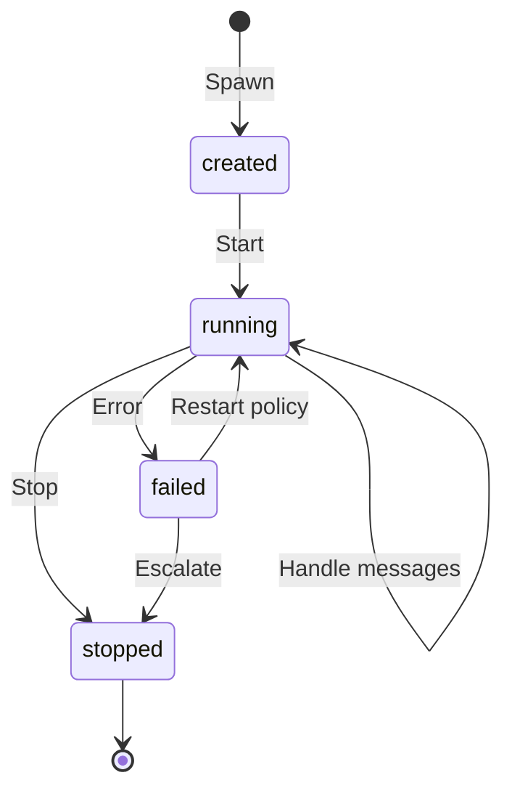

# Actor Framework

Astra’s **actor model** is the main concurrency pattern: each actor runs with a **mailbox** and handles messages **without shared mutable state** between actors. That keeps reasoning local and scales to many agents.

## Model

- **Message** — typed payload from a sender to a target actor.  
- **Actor** — identity, a handler for incoming messages, and a defined shutdown path.  
- **Runtime** — starts actors, delivers messages, and applies **backpressure** when mailboxes are full (senders must handle “mailbox full” rather than blocking forever).

## Lifecycle

## Communication

| Mode | Idea |
|------|------|
| **Same node** | Fast in-process delivery to a mailbox. |
| **Across nodes** | Messages routed via the platform bus so the right node delivers to the local mailbox. |

## Supervision

Supervisors manage child actors with policies such as **immediate restart**, **backoff**, **escalate to parent**, or **terminate**. If a child fails too often in a window, the supervisor **stops restart storms** by escalating or stopping — same idea as Erlang/OTP supervision trees.

## Durable state

Actors that own durable state **periodically persist** snapshots so restarts can resume. Frequency and retention are tuning concerns; see **PRD** for the intended durability model.

!!! note
    Implementation details (mailbox sizing, exact APIs) are not published here.
