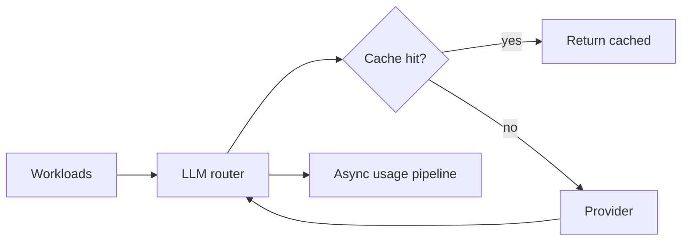

# LLM Routing

**LLM routing** is platform infrastructure: **model choice**, **response caching**, **usage tracking**, and **cost guardrails**. Workloads call the **router** rather than vendors directly.

## Model tiers

Typical tiers include **local** (fast / on-device), **premium** (higher capability), and **code-oriented** models. **Task type** and **priority** steer the default tier; overrides can be expressed per task where the PRD allows.

## Backends

Multiple **provider adapters** exist (cloud APIs, local inference stacks). Usage metadata (tokens, cost) is recorded when the adapter exposes it.

## Caching

Identical requests can be served from a **shared cache** with a long TTL so repeat prompts don’t re-hit providers. Cached entries preserve **usage fields** where applicable so dashboards stay consistent.

## Usage audit

Usage is written **asynchronously** so the **hot path** stays within latency targets (**PRD §23, §25**). Durable **cost and token** records feed billing and alerts.

## Cost controls

| Theme | Idea |
|-------|------|
| Quotas | Per-agent or per-day limits |
| Budget | Hard caps with approval to exceed |
| Cache | Reduce duplicate spend |
| Degrade | Temporarily restrict premium models on spike |
| Concurrency cap | Limit simultaneous provider calls |

## Observability

Cost and token **metrics** support dashboards and the [LLM cost spike runbook](../operations/runbook-cost-spike.md). Exact metric names: **PRD §17**.
