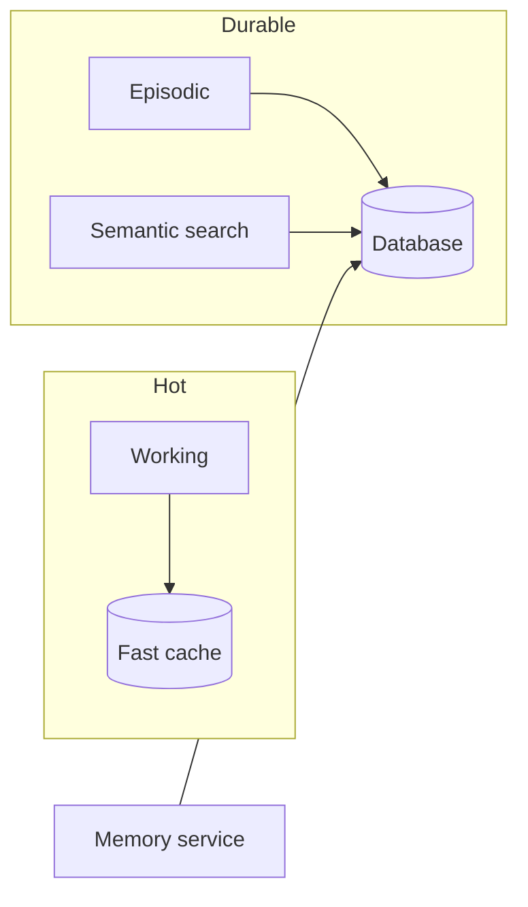

# Memory Subsystem

Agents use **several memory layers** with different latency, retention, and search behaviour.

## Tiers

| Tier | Storage | Use |
|------|---------|-----|
| **Working** | Fast ephemeral store | Active session / actor context |
| **Episodic** | Durable store | What happened, when |
| **Semantic** | Durable store + vector search | What is known, retrieved by meaning |

**Memory service** is the API for durable episodic/semantic reads and writes. Working memory is kept **hot** for responsiveness.

## Semantic search

Embeddings enable **similarity search** over stored memories (e.g. “what like this happened before?”). Indexing strategy (approximate ANN, dimensions) follows **PRD §11–13**.

## Phase-level history

Long-running goals can record **phase-level summaries** for later recall and analytics. Shape and retention are defined in the **PRD**.

!!! note
    Table layouts, embedding dimensions, and query text are specified in **PRD §11** — not duplicated on this public wiki.
