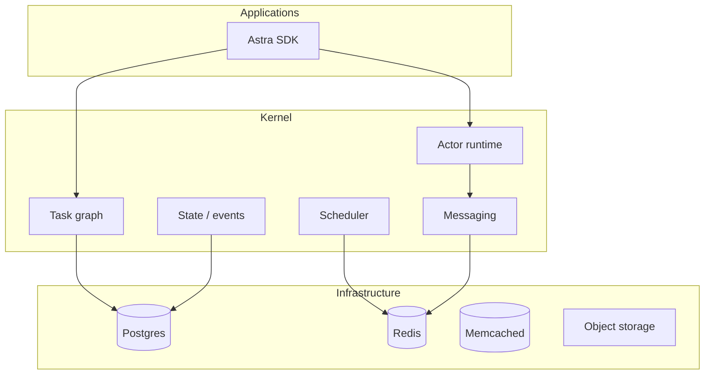
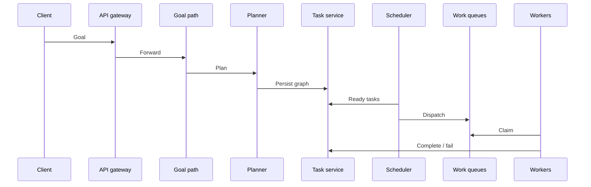

# Architecture Overview

Astra is built around a hard product constraint: **hot-path reads must stay fast** (see **PRD §25**). Cached layers back that goal; synchronous database reads on latency-sensitive user paths are avoided by design.

## Layers

Applications use the **Astra SDK**, which talks to a **microkernel-style core** (actors, task graph, scheduler, messaging, state). Below that: **Postgres**, **Redis**, **Memcached**, and **object storage**.

## Security and data plane

**Clients** use **TLS** to the **API gateway** with **JWT** auth. **Service-to-service** traffic uses **mTLS**. **Tool execution** is **sandboxed**; **secrets** are injected via **Vault** (or equivalent), not baked into images. See [Security](../security.md) and **PRD §18**.

## Kubernetes namespaces (summary)

| Namespace | Role |
|-----------|------|
| `control-plane` | Gateway, identity, access control |
| `kernel` | Scheduler, tasks, agents, goals, planner, memory |
| `workers` | Execution, browser, tools, LLM routing, prompts, evaluation, worker manager |
| `infrastructure` | Data stores and supporting services |
| `observability` | Metrics, logs, traces |

## Goal → task → result (flow)

1. Client submits a **goal** for an agent.  
2. **Goal** path validates and assembles context, then **planning** produces a **task DAG**.  
3. **Task service** persists the graph; **scheduler** finds ready tasks and **dispatches** to queues.  
4. **Workers** claim work, run **tool/sandbox** steps, then **complete** or **fail** tasks.  
5. Dependent tasks unlock; the cycle continues until the graph finishes.

## Caching (10ms read path)

Hot reads use **Redis** and **Memcached** with TTLs described in **PRD §13**. Writes go **durable first**, then **events**, then **cache refresh** — so caches can lag slightly behind the database by design.

!!! warning "Tradeoff"
    **Eventual consistency** on cached fields is accepted so the **10ms** read target stays achievable at scale.

## Hardware targets

**macOS** (Apple Silicon / Intel) and **Linux** (including GPU paths where configured) are supported deployment shapes; see **PRD §20** and [Deployment](../deployment/index.md).
