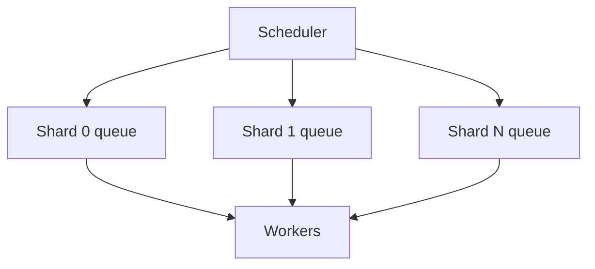

# Scheduler

The **scheduler** connects the **task graph** in the database to **workers** via **stream-based queues**. It runs on a periodic loop, finds **ready** tasks, and **dispatches** them so workers can claim work fairly under load.

## Latency targets (PRD §25)

| Metric | Target |
|--------|--------|
| Ready detection + dispatch | Median **≤50ms** |
| Including coordination | P95 **≤500ms** |
| Worker heartbeat | **~10s** |
| Worker considered lost | **~30s** without heartbeat |

## Behaviour (summary)

1. Find tasks that are **ready** (dependencies satisfied).  
2. **Atomically** mark them as eligible for dispatch and **publish** work to the appropriate **shard queue**.  
3. **Workers** consume from their consumer groups, run the task, then **complete** or **fail** via the task API.  
4. On **worker loss**, in-flight work is **re-queued** so another worker can pick it up; after **max retries**, tasks go to a **dead-letter** path.

## Sharding

Work is **partitioned by shard** (e.g. by agent or graph) so many schedulers and workers can scale **without one global bottleneck**. Same-graph work tends to stay on one shard — simple, but very large graphs can create **hot shards**; mitigations are an operational/design topic in the PRD.

## Tradeoffs

**Polling interval** balances **scheduling latency** vs **database load**; the PRD states the SLA targets the design aims for.

See [Runbook: Worker Lost](../operations/runbook-worker-lost.md) for **operator-facing** recovery (high level only on this wiki).
