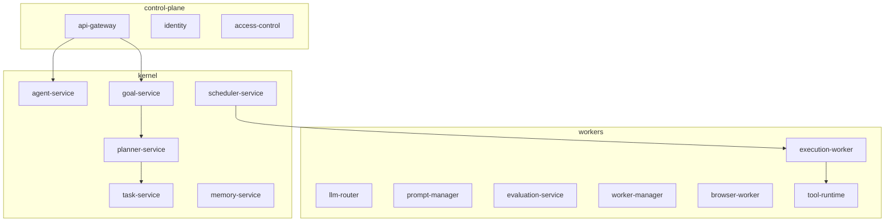

# Services — 16 Canonical Microservices

Each service is an **independently scalable process**. Services communicate over **gRPC** (internal, with **mTLS**) and expose **REST/WebSocket** only at the **API gateway** edge.

**External API surface:** Humans and integrations call **REST/WebSocket** on `api-gateway` only, with **JWT** auth. **Internal API:** services call each other over **gRPC with mTLS** — no direct Postgres access across arbitrary service boundaries; each service owns its integration pattern with the DB or cache.



## Service catalogue

| # | Service | Namespace | Responsibility |
|---|---------|-----------|----------------|
| 1 | `api-gateway` | control-plane | REST/WebSocket gateway, auth, rate limits, versioning |
| 2 | `identity` | control-plane | Users, JWT, service identity |
| 3 | `access-control` | control-plane | RBAC, approvals |
| 4 | `agent-service` | kernel | Agent lifecycle, profile & documents |
| 5 | `goal-service` | kernel | Goals, context to planner |
| 6 | `planner-service` | kernel | Goals → task graphs (LLM) |
| 7 | `scheduler-service` | kernel | Ready tasks, dispatch |
| 8 | `task-service` | kernel | Task/graph API |
| 9 | `llm-router` | workers | Model routing, cache, cost |
| 10 | `prompt-manager` | workers | Prompt templates & experiments |
| 11 | `evaluation-service` | workers | Validation & eval |
| 12 | `worker-manager` | workers | Worker registry & health |
| 13 | `execution-worker` | workers | General task execution |
| 14 | `browser-worker` | workers | Browser automation tasks |
| 15 | `tool-runtime` | workers | Sandboxed tool execution |
| 16 | `memory-service` | kernel | Episodic / semantic memory |

**Chat (v1):** Chat capability is built into `api-gateway`. No separate chat service for Phase 10.

### Optional services

| Service | Namespace | Responsibility |
|---------|-----------|----------------|
| `slack-adapter` | workers | Receives Slack Events API, verifies signing secret, resolves org/agent/user, enqueues to `astra:slack:incoming` Redis stream. Worker consumes stream, calls chat API, posts replies via Slack API. |
| `webhook-ingest` | workers | Accepts external events via `POST /webhooks/{source_id}` with HMAC-SHA256 validation. Publishes to Redis streams for downstream processing. |
| `cost-tracker` | workers | LLM cost aggregation and budget enforcement. |

## Inter-service communication

```
External → api-gateway (REST/WebSocket)
           ↓ gRPC
           agent-service, task-service, goal-service (kernel services)
           ↓ gRPC
           llm-router, memory-service, planner-service
           ↓ stream queues
           execution-worker, browser-worker
           ↓
           tool-runtime (sandbox)
```

## Agent lifecycle flow (summary)

**Goal submitted** → **context assembled** → **planner** builds **DAG** → **task service** persists graph → **scheduler** dispatches → **workers** run steps (including **sandbox** where needed) → **evaluation** where configured. Details: **PRD §9, §15**.

## Chat API (Phase 10)

| Method | Path | Description |
|---|---|---|
| `POST` | `/chat/sessions` | Create a chat session (`agent_id`, `title`) |
| `GET` | `/chat/sessions` | List chat sessions for authenticated user |
| `GET` | `/chat/sessions/{id}` | Get chat session details |
| `GET` | `/chat/ws` | WebSocket upgrade for streaming chat |

WebSocket framing: JSON types include `chunk`, `message_start`, `message_end`, `tool_call`, `tool_result`, `done`, `error`, `pong`, `session`. Config: `CHAT_ENABLED`, `CHAT_MAX_MSG_LENGTH`, `CHAT_RATE_LIMIT`, `CHAT_TOKEN_CAP`.

| `POST` | `/chat/sessions/{id}/inject` | External message injection (e.g., from Slack adapter) |

## Dashboard API (Phase 11)

Dashboard served at `/superadmin/dashboard/`. APIs under `/superadmin/api/dashboard/` and `/superadmin/api/slack/`.

| Area | Detail |
|------|--------|
| **Stack** | Vanilla HTML/CSS/JS. Fonts: Inter, Roboto Mono. Chart.js for charts. |
| **Visual** | Pastel palette (lavender accent, mint/sky/butter/rose/peach). Glass-style topnav. Light/dark theme toggle (persisted in `localStorage`). |
| **Sections** | Stats grid, charts (tasks, goals, service health, agents), agents table with pagination, goals, tasks, workers, approvals, cost, logs, Slack config tab, optional chat widget. |

## Agent profile and documents (summary)

| Method | Path | Description |
|---|---|---|
| `PATCH` | `/agents/{id}` | Update agent profile |
| `GET` | `/agents/{id}/profile` | Cached profile |
| `POST` | `/agents/{id}/documents` | Attach document (rule/skill/context_doc/reference) |
| `GET` | `/agents/{id}/documents` | List agent documents, optional `?doc_type=` filter |
| `DELETE` | `/agents/{id}/documents/{doc_id}` | Remove document |

**Context propagation flow:**

1. `goal-service` receives goal with optional inline documents → persists goal-scoped documents.
2. `goal-service` assembles full agent context: `system_prompt` + rules (priority-sorted) + skills + context_docs.
3. `goal-service` passes assembled `agent_context` to `planner-service`.
4. `planner-service` embeds `agent_context` in each task payload.
5. `execution-worker` includes `agent_context` when building LLM prompts for task execution.

Profile and document reads served from Redis cache (`agent:profile:{id}`, `agent:docs:{id}`, 5min TTL).
