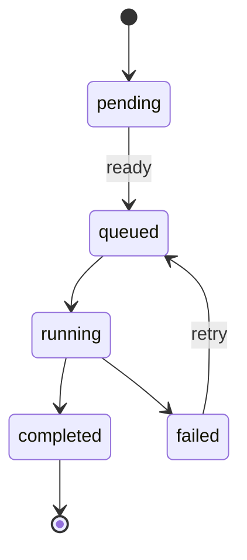

# Task Graph Engine

A **task graph** is a **DAG**: nodes are tasks, edges are **depends-on** relationships. The **scheduler** runs tasks when all dependencies have **completed**.

## States (conceptual)

Tasks move through states such as **pending → queued → running → completed**, with **failed** and **retry** paths. Exact names and transitions match **PRD §7**.

**Ready detection:** A task becomes runnable when every dependency has finished successfully.

**Concurrency:** State changes are applied so that **only valid transitions** win — duplicate or out-of-order completion is rejected safely.

## Durability

Graph structure and task rows live in the **database**. Each important transition is recorded in an **event log** in the same transactional spirit as the PRD — so the system can reason about history and recovery.

## Flexibility vs safety

Task **payloads** are structured for evolution (e.g. JSON-style fields) so new task types don’t always need schema churn; **validation** of payload shape is the caller’s responsibility. See **PRD §7**.
