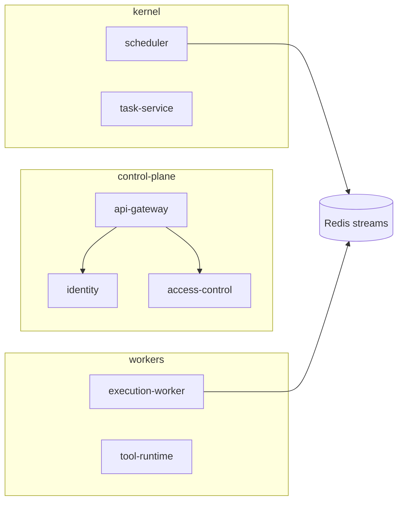

# Kubernetes / Helm

Production Astra on Kubernetes uses **namespaces** for isolation, **Helm** (charts live **in the Astra repo**), and **mTLS + Vault** for service identity and secrets per the PRD.

## Layout

| Namespace | Workload |
|-----------|----------|
| `control-plane` | `api-gateway`, `identity`, `access-control` |
| `kernel` | `scheduler-service`, `task-service`, `agent-service`, `goal-service`, `memory-service`, `planner-service` |
| `workers` | `execution-worker`, `browser-worker`, `tool-runtime`, `worker-manager`, `llm-router`, `prompt-manager`, `evaluation-service`, `slack-adapter` (optional), `webhook-ingest` (optional), `cost-tracker` |
| `infrastructure` | Postgres, Redis, Memcached, MinIO (local) or managed equivalents (GCP: Cloud Storage) |
| `observability` | Prometheus, Grafana, OTel collector, Loki |

## Helm highlights

- Values for image tags, replica counts, resource requests/limits.
- Ingress or Gateway API for `api-gateway` TLS termination at edge; **service-to-service** traffic uses mTLS (cert mounts from Vault or cert-manager).
- **Secrets**: inject at runtime from Vault — not baked into images or plain ConfigMaps for credentials.

## Upgrade order

1. Schema migrations (backward-compatible with running binaries).
2. Stateless services (rolling update).
3. Workers after scheduler/task contracts are stable.
4. Canary slice (e.g. 5% traffic) before full rollout where supported.

## Scaling

- **HPA** on CPU/request rate for API and stateless services.
- **Workers** — scale on Redis queue depth and scheduler hints (PRD §20).

## Related

- [GCP managed services](gcp.md) — when Redis/Postgres are outside the cluster.
- [Local](local.md) — docker-compose parity for dev.
- PRD §20 Deployment architecture
