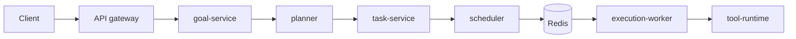

# Astra

**Astra** is an operating system for autonomous agents: a **microkernel** (actors, task graph, scheduler, messaging, state), **sixteen microservices**, sandboxed tools, layered memory, LLM routing, **real-time chat**, and **platform stability infrastructure** — not a single-model chat wrapper or a UI product.

**Executive summary:** Persistent agents submit **goals**; the **planner** materialises **DAGs** of **tasks**; the **scheduler** dispatches work via **Redis Streams**; **workers** run tasks inside **sandboxes**; **Postgres** is the source of truth and **Redis/Memcached** enforce the **≤10ms** read path. Everything external talks through **JWT**; services talk over **mTLS**; dangerous work passes **policy and approval** gates. Agents can have **profiles** (system prompts, attached documents) that propagate through planning to execution, and users can interact via **WebSocket chat** or **Slack**.

## Goals

| Goal | Target |
|------|--------|
| **Scale** | Millions of agents, 100M+ tasks/day (PRD §1). |
| **Latency** | No hot-path API read over **10ms** p99; scheduling median **≤50ms**, P95 **≤500ms** (PRD §25). |
| **Safety** | Sandboxed tools, RBAC, approvals, secrets in Vault, mTLS everywhere between services. |
| **Operability** | Metrics, traces, runbooks, rolling upgrades with backward-compatible schema. |
| **Resilience** | Agent restore on startup, dead-letter tasks, circuit breakers, consumer retry, goal idempotency (PRD §21, P0-P2). |

## Core capabilities (PRD v3.0)

- **Platform stability (P0-P2):** Agent restore on startup, task dead-letter queue, Redis consumer retry/reclaim, readiness vs liveness probes, gateway circuit breakers, goal idempotency, configurable task-stream sharding, supervisor wiring, mailbox-full handling.
- **Agent profile & context (Phase 9):** System prompts, attached documents (rules, skills, context docs, references), context propagation through planning and execution pipeline.
- **Real-time chat agents (Phase 10):** WebSocket streaming with tool invocation, session management, message injection.
- **Slack integration (Phase 12):** Connect chat agents to Slack workspaces, proactive posting, platform-configurable Slack app secrets.
- **Hardware acceleration:** Metal/Neural Engine on macOS, CUDA on Linux, graceful CPU fallback. macOS is a supported production target.
- **Olympus application layer:** External agent adapter framework, webhook ingest, goal-level dependencies, agent-to-agent goal posting, dual-approval, trust scores.

## Non-goals

- **Not** building foundation models — Astra integrates providers.
- **Not** replacing every data platform — it composes Postgres, Redis, object storage, etc.
- **Not** embedding app logic in the kernel — strict kernel/SDK/app boundary (PRD §2).
- **Not** only a chat product — chat is one surface on the gateway; core is the task graph and actor runtime.

## Who should read what

| Role | Start with |
|------|------------|
| **New contributor** | [Getting started](getting-started/index.md) → [Glossary](glossary.md) → [Architecture overview](architecture/overview.md) |
| **Backend engineer** | [Kernel](architecture/kernel.md), [Task graph](architecture/task-graph.md), [Services](architecture/services.md) |
| **Operator** | [Operations](operations/index.md), [Deployment](deployment/index.md), runbooks |
| **Security reviewer** | [Security](security.md), PRD §18 |

## Reading order

1. This page → [Glossary](glossary.md) if terms are unfamiliar.  
2. [Architecture overview](architecture/overview.md) — layers and goal→task flow.  
3. [Services](architecture/services.md) — all sixteen services.  
4. [Reference](reference/index.md) — contracts, schema, Redis, APIs.  
5. [Operations](operations/index.md) when you’re on call.

## At a glance

| Dimension | Value |
|-----------|-------|
| Language | Go (primary), Python tooling |
| Kernel | Microkernel + actor runtime |
| Tasks | Distributed DAG, transactional state |
| Bus | Redis Streams + consumer groups |
| Source of truth | Postgres (+ pgvector) |
| Hot cache | Redis, Memcached |
| Sandboxing | WASM / Docker / Firecracker |
| Services | 16 canonical microservices |
| Spec | [PRD](https://github.com/prashanthrajagopal/astra/blob/main/docs/PRD.md) in the Astra repo |

!!! note "Maturity"
    Astra tracks **Engineering Specification v3.0** (PRD). Phases 0–10 are complete; Phase 11 (multi-tenancy) is in progress; Phase 12 (Slack) is partial. When in doubt, read the PRD section cited on each page.

---

## Sections

-   :material-rocket-launch:{ .lg } **Getting Started**

    ---

    Repo layout, prerequisites, local paths.

    [:octicons-arrow-right-24: Getting started](getting-started/index.md)

-   :material-book-alphabet:{ .lg } **Glossary**

    ---

    Terms and acronyms.

    [:octicons-arrow-right-24: Glossary](glossary.md)

-   :material-shield-lock:{ .lg } **Security**

    ---

    mTLS, JWT, sandbox, Vault, approvals.

    [:octicons-arrow-right-24: Security](security.md)

-   :material-layers:{ .lg } **Architecture**

    ---

    Kernel, actors, scheduler, memory, LLM routing.

    [:octicons-arrow-right-24: Architecture](architecture/index.md)

-   :material-book-open-variant:{ .lg } **Reference**

    ---

    gRPC, schema, Redis, APIs, metrics, SLAs.

    [:octicons-arrow-right-24: Reference](reference/index.md)

-   :material-monitor-eye:{ .lg } **Operations**

    ---

    Runbooks and incident flow.

    [:octicons-arrow-right-24: Operations](operations/index.md)

-   :material-cloud-upload:{ .lg } **Deployment**

    ---

    K8s, local, macOS, GCP.

    [:octicons-arrow-right-24: Deployment](deployment/index.md)

