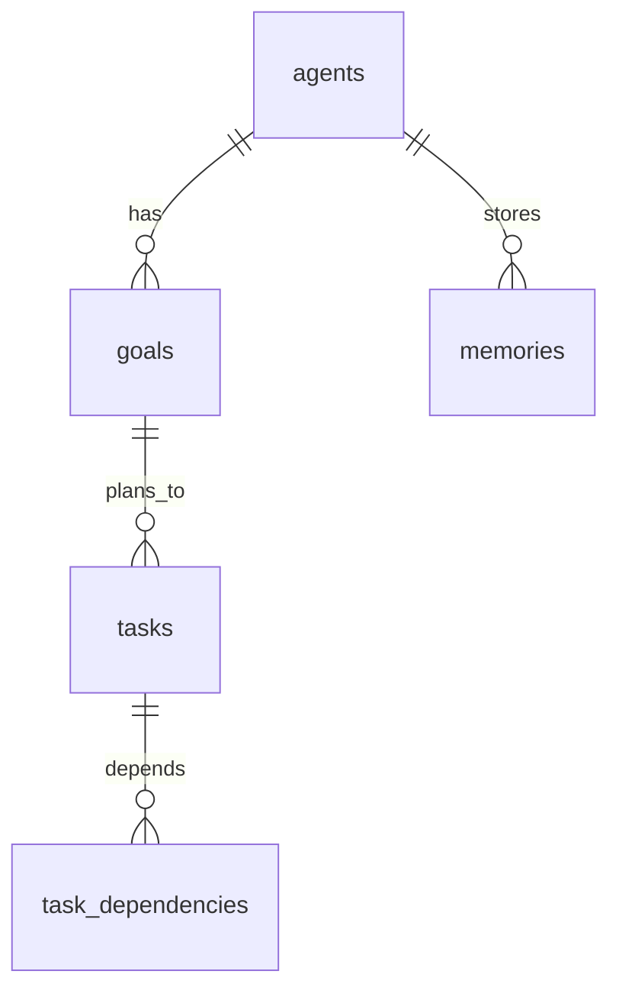

# Database Schema

The **authoritative** database design — tables, migrations, indexes, and constraints — is **PRD §11** in the Astra repository. This page only sketches **relationships** for readers of the public wiki.

## Conceptual model

Core ideas:

- **Agents** own **goals**; goals expand into **task graphs**.  
- **Tasks** link via **dependencies** forming a DAG.  
- **Events** record important lifecycle changes.  
- **Memories** store episodic/semantic content; **workers**, **usage**, and **documents** appear as in the PRD.

!!! note
    **No migration numbers, column lists, or SQL filenames** are published here. Contributors use the repo and PRD.
