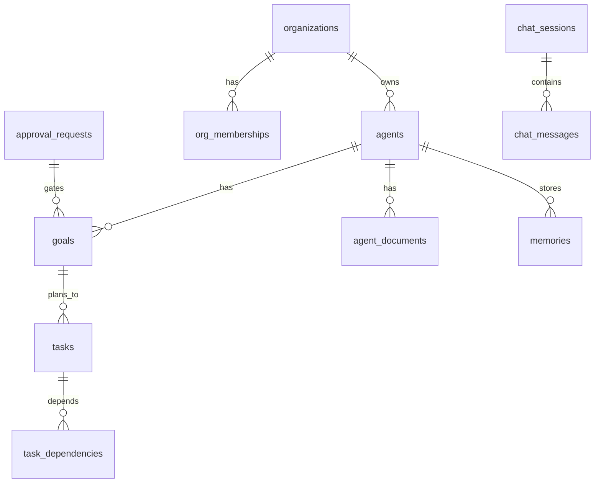

# Database Schema

The **authoritative** database design — tables, migrations, indexes, and constraints — is **PRD §11** in the Astra repository. This page sketches **relationships** and documents the migration history for contributors.

## Conceptual model

Core ideas:

- **Agents** are scoped to **organizations**; goals expand into **task graphs**.
- **Tasks** link via **dependencies** forming a DAG.
- **Events** record immutable lifecycle changes.
- **Memories** store episodic/semantic content.
- **Chat sessions** are per-agent; messages stream via WebSocket.
- **Approval requests** gate plan execution and risky tool calls.

## Migration history

### 0013 — Agent profile

- `system_prompt TEXT` column on `agents`.
- `agent_documents` table: `id`, `agent_id`, `goal_id`, `doc_type` (`rule`/`skill`/`context_doc`/`reference`), `name`, `content`, `uri`, `metadata`, `priority`.

### 0014 — Approval types

Adds to `approval_requests`: `request_type` (`plan`/`risky_task`), `goal_id`, `graph_id`, `plan_payload JSONB`.

### 0015 — Unique agent names

De-duplicates existing agents by name, then adds `UNIQUE(agents.name)` constraint.

### 0016 — Chat

- `chat_sessions` table: `id`, `agent_id`, `user_id`, `org_id`, `title`, `retention_days`, `created_at`.
- `chat_messages` table: `id`, `session_id`, `role`, `content`, `metadata`, `created_at`.
- `agents.chat_capable BOOLEAN` column.

### 0018 — Multi-tenancy

New tables: `users`, `organizations`, `org_memberships`, `teams`, `team_memberships`, `agent_collaborators`, `agent_admins`.

`org_id` added to: `agents`, `goals`, `tasks`, `workers`, `events`, `memories`, `llm_usage`, `approval_requests`, `chat_sessions`.

`visibility` column added to `agents` (`private`/`org`/`public`).

### 0024 — Agent hardening

- `agent_config_revisions` table — versioned config history.
- `tool_definitions` table — per-agent allowed tool catalog.
- New columns on `agents`: `drain_mode BOOLEAN`, `max_concurrent_goals INT`, `daily_token_budget BIGINT`, `priority INT`, `allowed_tools TEXT[]`.
- `chat_sessions.retention_days INT`.
- `memories.expires_at TIMESTAMPTZ`.

### 0026 — Goal dependencies

New columns on `goals`: `cascade_id UUID`, `depends_on_goal_ids UUID[]`, `completed_at TIMESTAMPTZ`, `source_agent_id UUID`.

### 0027 — Agent trust

New columns on `agents`: `trust_score FLOAT`, `tags TEXT[]`, `metadata JSONB`.

### 0028 — Dual approval

New columns on `approval_requests`: `required_approvals INT` (default 1), `approvals JSONB` (array of `{user_id, decision, decided_at}`).
