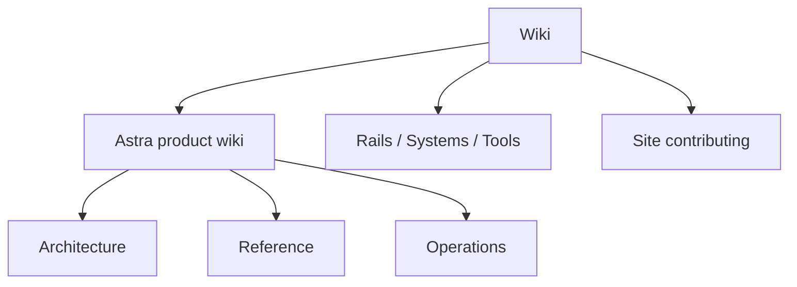

# Wiki

This wiki is the **technical companion** to [prashanthr.net](https://prashanthr.net): the **Astra** product specification (architecture, reference, operations, deployment) plus **personal engineering notes** on Ruby on Rails, distributed systems, tools, and how this site is built.

## Audience

| Who | Start here |
|-----|------------|
| **Astra contributors** | [Astra overview](../astra/) → [Architecture overview](../astra/architecture/overview/) → [Reference](../astra/reference/) |
| **Operators / SRE** | [Operations](../astra/operations/) → runbooks → [Deployment](../astra/deployment/) |
| **Readers of the blog** | [Blog](../blog/) — longer essays; wiki is structured reference |
| **Site contributors** | [Site contributing](getting-started.md) — Zensical, frontmatter, CI |

## How to read the Astra docs

1. **[Astra home](../astra/)** — vision, goals, non-goals, scale targets.
2. **[Architecture → Overview](../astra/architecture/overview/)** — layers, data flow, Kubernetes layout.
3. **[Glossary](../astra/glossary.md)** — terms and acronyms.
4. Deep dives: kernel, task graph, scheduler, services, memory, LLM routing as needed.

For **Astra**, the authoritative spec is **`docs/PRD.md`** in the [Astra repository](https://github.com/prashanthrajagopal/astra) (or your fork). This wiki summarises and diagrams it; if something disagrees with the PRD, **the PRD wins**.

## Wiki map

## Sections

-   :material-rocket-launch:{ .lg } **Astra**

    ---

    Microkernel agent OS: 16 services, task graph, scheduler, memory, LLM routing.

    [:octicons-arrow-right-24: Astra](../astra/)

-   :material-book-open-variant:{ .lg } **Blog**

    ---

    Essays on kernels, Rails, and production.

    [:octicons-arrow-right-24: Blog](../blog/)

-   :material-language-ruby:{ .lg } **Ruby & Rails**

    ---

    Framework philosophy and how it informs system design.

    [:octicons-arrow-right-24: Rails](rails/index.md)

-   :material-server-network:{ .lg } **Systems**

    ---

    Caching, streams, consistency, observability.

    [:octicons-arrow-right-24: Systems](systems/index.md)

-   :material-wrench:{ .lg } **Tools**

    ---

    Editor, Zensical, Git, CLI debugging.

    [:octicons-arrow-right-24: Tools](tools/index.md)

-   :material-file-document-edit:{ .lg } **Site contributing**

    ---

    Authoring and publishing this site.

    [:octicons-arrow-right-24: Contributing](getting-started.md)

