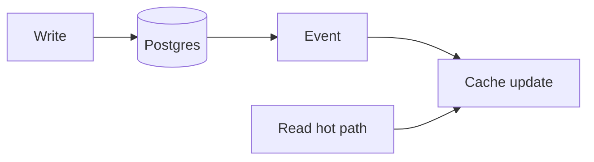

# Systems

Distributed systems ideas that show up in production platforms: **caching**, **streams**, **consistency**, **observability**. Astra encodes many of these as hard SLAs (10ms reads, scheduling latency).

## Subpages

| Page | Focus |
|------|--------|
| [Caching](caching.md) | Read paths, stampede, TTL |
| [Streaming](streaming.md) | Redis streams, consumer groups |
| [Consistency](consistency.md) | Postgres vs cache |
| [Observability](observability.md) | Metrics, logs, traces |

